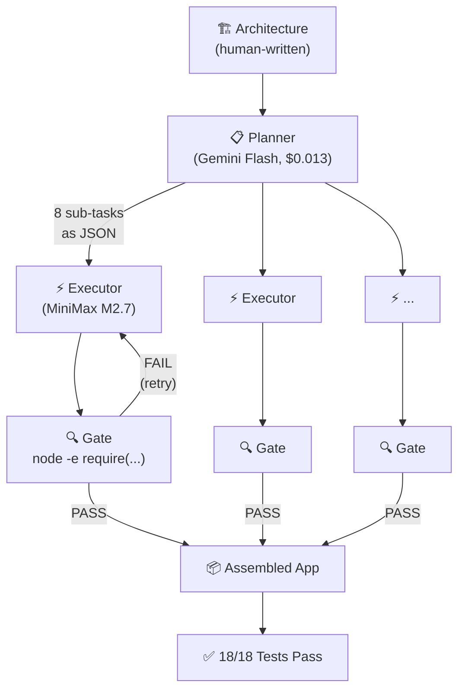

# AI Code Orchestration Research

**Can AI build real applications from scratch — and what's the cheapest way?**

This repository contains the research, experiments, and results from testing multi-model AI orchestration approaches for autonomous code generation. Inspired by [Karpathy's autoresearch](https://github.com/karpathy/autoresearch) pattern.

## 🏆 Headline Result

**Gemini Flash + MiniMax M2.7 built a complete, tested Node.js CLI application from scratch for $0.069.**

- 8/8 sub-tasks passed structural gates
- 18/18 tests passing
- 7 source files, ~500 lines
- Zero npm dependencies
- 9 total API calls

## The Research

We tested **4 fundamentally different approaches** across **6 models** at price points spanning 200x:

| Approach | Best Config | Sub-tasks | Tests | Cost | Verdict |
|----------|------------|-----------|-------|------|---------|
| **A: Quality-First** | Gemini + MiniMax | **8/8 (100%)** | **18/18** | **$0.069** | **🏆 Winner** |
| **B: Generate & Filter** | Gemini + Qwen3-30B | 7/8 (88%) | TBD | $0.237 | Good |
| **C: LLM Council** | 3-model council | 6/8 (75%) | TBD | $0.192 | Decent |
| **D: Evolutionary** | Qwen3-30B | 0/8 (0%) | 0 | $0.265 | Failed |

## Documentation

Browse the full research documentation:

- **[Spike V1 Report](experiments/spike-v1/REPORT.md)** — 11 models tested on a bash task
- **[Spike V2 Report](experiments/spike-v2/REPORT.md)** — 4 approaches building a Node.js CLI
- **[Architecture Spec](experiments/spike-v2/architecture.md)** — The dep-doctor specification
- **[Experiment README](experiments/spike-v2/README.md)** — Full methodology with Mermaid diagrams
- **[Golden Master](golden-master/)** — The human-written reference implementation

## How It Works



## Key Findings

1. **The model isn't the bottleneck — the architecture is.** MiniMax ($0.013/call) beat Sonnet ($0.013/call via OpenRouter) because Gemini's plan was better.

2. **Structural gates are the quality filter.** `node -e "require('./lib/parser.cjs')"` catches bad code deterministically.

3. **Small sub-tasks are key.** 8 focused tasks (1-2 files each) > 10 granular ones.

4. **The "full file output" pattern is universal.** `--- FILE: path --- ... --- END FILE ---` works across all model families.

5. **Karpathy was right: "If verifiable, then optimizable."** Node.js code with `require()` gates is perfectly verifiable.

## Repository Structure

```
├── docs/                          # Research documentation
├── experiments/
│   ├── spike-v1/                  # 11-model comparison (bash task)
│   └── spike-v2/                  # 4-approach comparison (Node.js CLI)
│       ├── approach-a/            # Quality-first results
│       ├── approach-b/            # Generate-and-filter results
│       ├── approach-c/            # LLM council results
│       └── approach-d/            # Evolutionary results
├── golden-master/                 # Human-written reference implementation
│   ├── dep-doctor/                # The CLI tool (18/18 tests)
│   └── golden-outputs/            # Expected output snapshots
├── infrastructure/                # Experiment runner scripts
└── site/                          # Documentation viewer (HTML/JS/CSS)
```

## Running the Experiments

```bash
# Prerequisites
export OPENROUTER_API_KEY=your_key

# Run the winning config (A3: Gemini plan + MiniMax execute)
bash experiments/spike-v2/run-experiment.sh --approach A --config A3

# Run all approaches
for cfg in A1 A2 A3 A4 B1 C1 D1; do
    bash experiments/spike-v2/run-experiment.sh --approach ${cfg:0:1} --config $cfg &
done
wait
```

## Cost Comparison

| Method | Cost | Quality | Time |
|--------|------|---------|------|
| This research (A3) | **$0.069** | 18/18 tests | 4 min |
| Claude Sonnet (single call) | $1.68 | 0 tests | 15 min |
| Claude Opus (single call) | $3.00+ | Sometimes works | 20 min |
| Human developer | ~$50-$100/hr | High | 2 hours |

## References

- [Karpathy — autoresearch](https://github.com/karpathy/autoresearch)
- [Karpathy — "If verifiable, then optimizable"](https://karpathy.bearblog.dev/verifiability/)
- [Karpathy — LLM Council](https://github.com/karpathy/llm-council)
- [TDAD — Test-Driven Agentic Development](https://arxiv.org/html/2603.17973)
- [AlphaCode — Generate and Filter](https://deepmind.google/blog/competitive-programming-with-alphacode/)

## License

MIT
