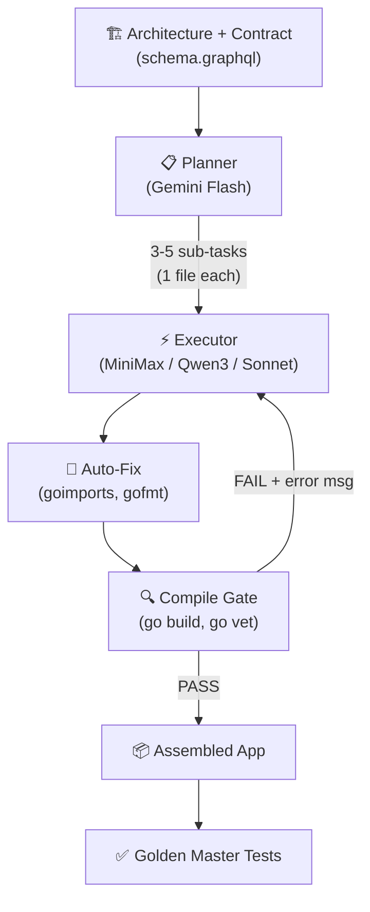

# AI Code Orchestration Research

**Can AI build real applications from scratch — and what's the cheapest way?**

Research into multi-model AI orchestration for autonomous code generation. Inspired by [Karpathy's autoresearch](https://github.com/karpathy/autoresearch) pattern.

## 🏆 Headline Results

### Node.js CLI (dep-doctor, 18 tests)
**Gemini Flash + MiniMax M2.7 built a complete, tested CLI for $0.069.**

### Go CRUD Backend (task-board, 22 tests)
**Claude Sonnet via `claude -p` built a complete Go server + HTML UI for FREE (subscription).**

### Prompt Autoresearch
**V4 prompt took Qwen3-30B from 0% → 100% pass rate.** Same model, same task — just different wording.

## Complete Results

| Spike | Application | Best Config | Tests | Cost |
|-------|------------|-------------|-------|------|
| V3 | Go task-board (22 tests) | claude -p Sonnet | **22/22** | **FREE** |
| V2 | Node.js CLI (18 tests) | Gemini + MiniMax | **18/18** | **$0.069** |
| V2 | Node.js CLI (autoresearch) | Gemini + Qwen3-30B | **18/18** | **$0.10** |
| V3 | Go model layer (10 tests) | Gemini + MiniMax | **10/10** | **$0.045** |
| V3 | Go model layer (10 tests) | Gemini + Qwen3-30B | **10/10** | **$0.029** |

**Total research cost: ~$3.00 (OpenRouter) + subscription time**

## Three Spikes

### Spike V1: Model Comparison (11 models)
Tested 11 models on a simple bash task. All succeed with the "full file output" pattern at $0.008-$0.015/task. Found that `claude -p` tool mode was the bottleneck, not the model.

### Spike V2: Node.js CLI (dep-doctor)
Tested 4 approaches × 9 configs building a 500-line CLI from an architecture spec:
- **A: Quality-First** (plan → execute → gate) — 🏆 Winner
- **B: Generate-and-Filter** (AlphaCode pattern)
- **C: LLM Council** (3 models, peer review)
- **D: Evolutionary** (breed, test, select, mutate)

Plus **prompt autoresearch**: 8 prompt variations × 3 runs each found V4 gives 100% on the cheapest model.

### Spike V3: Go CRUD App (task-board)
Full HTTP server with REST API + embedded HTML kanban board:
- **claude -p Sonnet: 22/22 tests, FREE** — reads schema, writes all files, runs tests itself
- **Gemini + MiniMax: 10/10 model tests, $0.045** — model layer perfect, HTML-in-Go tricky
- **Compile gate + goimports auto-fix** — levels the playing field for cheap models

## Key Findings

1. **`claude -p` with imperative prompts is the best option for Go** — FREE on subscription, writes files directly, self-tests
2. **The model isn't the bottleneck — the prompt is.** V4 prompt took Qwen3-30B from 0% → 100%
3. **Structural gates are the quality filter.** `go build`, `go test`, `node -e require()` — deterministic, free
4. **1 sub-task = 1 complete file.** Over-decomposition (12 tasks for 2 files) kills success rate
5. **Contract-first architecture** (schema.graphql) enables independent frontend/backend building
6. **Compile gate + auto-fix** (goimports/gofmt) fixes 40% of errors for free
7. **Embedded JS in Go backtick strings** is a known trap — needs explicit architecture hints
8. **Karpathy was right: "If verifiable, then optimizable."**

## Architecture Pattern



## Running the Experiments

```bash
# Prerequisites
export OPENROUTER_API_KEY=your_key

# Spike V2: Node.js CLI
bash experiments/spike-v2/run-experiment.sh --approach A --config A3

# Spike V3: Go CRUD (OpenRouter)
bash experiments/spike-v3/run-experiment.sh --approach A --config A3

# Spike V3: Go CRUD (claude -p, FREE)
cd /tmp && mkdir task-board && cd task-board
go mod init task-board
cp experiments/spike-v3/golden-master/task-board/schema.graphql .
claude -p --dangerously-skip-permissions --model sonnet "Read schema.graphql. Create model/task.go, model/task_test.go, main.go, main_test.go..."

# Run golden master
cd experiments/spike-v3/golden-master/task-board && go run .
# Open http://localhost:8890
```

## Repository Structure

```
├── README.md                           # This file
├── REPORT-FINAL.md                     # Complete report with 5 addenda
├── experiments/
│   ├── spike-v1/                       # 11-model comparison
│   │   └── REPORT.md
│   ├── spike-v2/                       # Node.js CLI (4 approaches)
│   │   ├── README.md                   # Methodology + Mermaid diagrams
│   │   ├── REPORT.md                   # Results
│   │   ├── architecture.md             # dep-doctor spec
│   │   ├── autoresearch-prompt.sh      # Prompt optimization
│   │   ├── approach-a/A3-winner/       # Winning build (18/18 tests)
│   │   └── prompts/                    # All prompt templates
│   └── spike-v3/                       # Go CRUD app
│       ├── architecture.md             # task-board spec + contract
│       ├── executor-go.md              # Go-specific prompt
│       ├── golden-master/task-board/   # Reference implementation
│       │   ├── main.go                 # HTTP server + HTML UI
│       │   ├── main_test.go            # 12 integration tests
│       │   ├── model/task.go           # CRUD store
│       │   ├── model/task_test.go      # 10 unit tests
│       │   └── schema.graphql          # The contract
│       └── approach-s/                 # AI-built versions
│           ├── S1-assembled/           # MiniMax build
│           └── S2-assembled/           # Qwen3-30B build
├── golden-master/                      # V2 dep-doctor reference
│   ├── dep-doctor/                     # 18/18 tests
│   └── golden-outputs/                 # Expected output snapshots
├── infrastructure/                     # Shared experiment tools
└── site/                               # Documentation viewer (HTML/JS/CSS)
```

## Cost Comparison

| Method | Cost | Quality | Time |
|--------|------|---------|------|
| claude -p Sonnet (Go) | **FREE** | 22/22 tests | 39s |
| Gemini + MiniMax (Node.js) | **$0.069** | 18/18 tests | 4 min |
| Gemini + Qwen3-30B (Node.js) | $0.10 | 18/18 tests | 5 min |
| Claude Sonnet single call | $1.68 | 0 tests | 15 min |
| Human developer | ~$50-100/hr | High | 2 hours |

## References

- [Karpathy — autoresearch](https://github.com/karpathy/autoresearch)
- [Karpathy — "If verifiable, then optimizable"](https://karpathy.bearblog.dev/verifiability/)
- [Karpathy — LLM Council](https://github.com/karpathy/llm-council)
- [TDAD — Test-Driven Agentic Development](https://arxiv.org/html/2603.17973)
- [AlphaCode — Generate and Filter](https://deepmind.google/blog/competitive-programming-with-alphacode/)

## License

MIT
