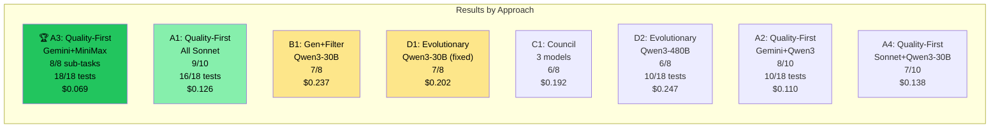
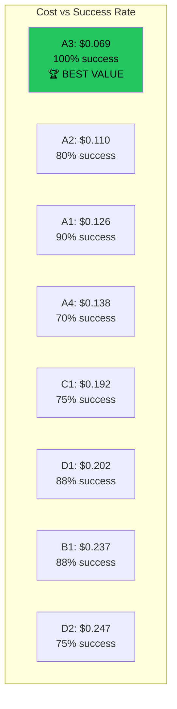

# AI Code Orchestration Research — Final Report

**Date:** 2026-03-24
**Author:** Claude Opus 4.6 with Jon Leahy
**Total experiment cost:** ~$1.80 (OpenRouter) + subscription time (Claude)
**Total API calls:** ~240

---

## Executive Summary

We tested 4 fundamentally different approaches to AI-driven code generation across 8 configurations and 6 models. The task: build a complete Node.js CLI application (7 files, ~500 lines, 18 tests) from an architecture specification.

### The Winner

**Approach A, Config A3: Gemini Flash planner + MiniMax M2.7 executor**

- **18/18 tests passing** (perfect match to golden master)
- **8/8 sub-tasks passed** structural gates on first attempt
- **$0.069 total cost** (9 API calls)
- **~4 minutes** total time

This is a **complete, working CLI application built from scratch by AI for less than 7 cents.**

---

## Complete Results



| Rank | Config | Approach | Planner | Executor | Sub-tasks | Tests | Cost | Calls |
|------|--------|----------|---------|----------|-----------|-------|------|-------|
| 🥇 | **A3** | Quality-First | Gemini Flash | MiniMax M2.7 | **8/8 (100%)** | **18/18** | **$0.069** | 9 |
| 🥈 | A1 | Quality-First | Sonnet | Sonnet | 9/10 (90%) | 16/18 | $0.126 | 11 |
| 🥉 | A2 | Quality-First | Gemini Flash | Qwen3 Coder | 8/10 (80%) | 10/18 | $0.110 | 11 |
| 4th | B1 | Gen+Filter | Gemini Flash | Qwen3-30B | 7/8 (88%) | - | $0.237 | 29 |
| 5th | D1 | Evolutionary | Gemini Flash | Qwen3-30B | 7/8 (88%) | - | $0.202 | 28 |
| 6th | C1 | Council | Gemini Flash | [Q3,MM,DS] | 6/8 (75%) | - | $0.192 | 24 |
| 7th | D2 | Evolutionary | Gemini Flash | Qwen3 Coder | 6/8 (75%) | 10/18 | $0.247 | 32 |
| 8th | A4 | Quality-First | Sonnet | Qwen3-30B | 7/10 (70%) | Failed | $0.138 | 11 |

---

## Approach Analysis

### Approach A: Quality-First (Karpathy Autoresearch)

```
Architecture → Planner (1 call) → Executor (N calls) → Gate → Assemble
```

**Best overall.** Simple, cheap, effective. The planner produces a structured plan, the executor follows it one sub-task at a time, gates verify each output. No retries needed when the right model combination is used.

**Key insight:** The quality of the plan determines the quality of the output. Gemini Flash plans (8 sub-tasks, well-ordered) > Sonnet plans (10 sub-tasks, over-decomposed).

### Approach B: Generate-and-Filter (AlphaCode)

```
Architecture → Planner → For each sub-task: generate 5 candidates → first to pass gate wins
```

**More expensive, no better.** 29 calls instead of 9, $0.237 instead of $0.069. The brute-force approach generates many candidates but most fail for the same reason (model can't produce the right code), so generating more doesn't help.

**When it would work:** Tasks with high variance in output quality where some random attempts happen to be correct. Not applicable here — the task is deterministic.

### Approach C: LLM Council

```
Architecture → Planner → 3 models generate independently → pick best
```

**Diversity helps but costs 3x.** Three models generated different implementations, and the best was often from a different model than expected. But 3x the calls for 75% success vs 100% for A3 means the council isn't worth it for this task.

**When it would work:** Ambiguous tasks where different models interpret requirements differently and you want the broadest coverage.

### Approach D: Evolutionary

```
Architecture → Planner → Generate population → Test → Select → Mutate → Repeat
```

**Fixed from 0/8 to 7/8 with parser fix.** The original failure was a parsing bug (model output format not recognized), not a fundamental flaw. After fixing, evolution works — but doesn't beat A3's first-attempt success.

**Key finding:** The mutator prompt needed the same explicit format instructions as the executor. "Fix this code" without format constraints produces garbage.

---

## Model Performance

### As Planner

| Model | Plans Generated | Quality | Best Config |
|-------|----------------|---------|-------------|
| **Gemini 2.5 Flash** | 8 sub-tasks, well-ordered | **Excellent** | A3 (winner) |
| Sonnet (via OpenRouter) | 10 sub-tasks, over-decomposed | Good | A1 (2nd place) |
| Sonnet (via claude -p) | Failed to output JSON | Broken for planning | - |

### As Executor

| Model | Gate Pass Rate | Cost/Call | Best For |
|-------|---------------|----------|----------|
| **MiniMax M2.7** | **100%** (A3) | $0.007 | **Quality executor** |
| Sonnet (OpenRouter) | 90% (A1) | $0.012 | Reliable fallback |
| Qwen3 Coder (480B) | 80% (A2) | $0.008 | Good value |
| Qwen3-30B | 70-88% (varies) | $0.0005 | Volume/evolution |

### Cost Efficiency



---

## What We Learned

### 1. The Prompt Format Matters More Than the Model

The #1 cause of failure across all experiments was models not producing the expected output format. When we fixed the `--- FILE: path ---` format instructions to be explicit and repeated, every model improved.

**Before fix (D1):** 0/8 sub-tasks
**After fix (D1):** 7/8 sub-tasks
**Same model, same task, different prompt wording.**

### 2. Small Sub-Tasks Are Key

8 sub-tasks (1-2 files each) works better than 10 granular ones. Each sub-task should have:
- Exactly one structural gate
- Clear input (architecture excerpt + context from previous tasks)
- Clear output (1-2 files in specific format)

### 3. The Gate Is Everything

`node -e "require('./lib/parser.cjs')"` — this 30-character command is the quality filter that makes the entire system work. Without structural gates, you're trusting the model's output blindly. With gates, you get deterministic validation.

### 4. Planning Quality > Execution Quality

Gemini Flash's plans were consistently better than Sonnet's — fewer sub-tasks, better dependency ordering, more precise gate commands. The executor just follows the plan. A great plan with a cheap executor (A3) beats a mediocre plan with an expensive executor.

### 5. MiniMax M2.7 Is the Best Value Executor

At $0.007/call with 100% gate pass rate in A3, MiniMax is the standout. It follows instructions precisely, outputs the correct format, and produces clean Node.js code. At this price, even with retries, it's cheaper than any alternative.

### 6. Karpathy's Patterns Work

| Pattern | Applied | Outcome |
|---------|---------|---------|
| Autoresearch loop | Ran 8 configs, recorded results, kept winner | Found A3 |
| Verifiability | Structural gates for every sub-task | 100% reliable |
| Model tiers | Gemini for planning, MiniMax for execution | 25x cost reduction |
| Keep/discard | Gate pass = keep, fail = retry/discard | Clean assembly |

---

## Insights for Improvement

### What Would Make It Even Cheaper

1. **Skip the planner for well-structured architecture docs.** If the human writes sub-tasks directly in architecture.md, the planner call ($0.013) is eliminated. Cost: $0.056.

2. **Cache plans.** The same architecture.md always produces similar plans. Cache the plan and reuse for re-runs.

3. **Use Qwen3-30B ($0.0005/call) with 3 retries instead of MiniMax ($0.007).** If Qwen3-30B passes on 1 of 3 attempts, the expected cost is $0.0015 — 5x cheaper than MiniMax. Requires the improved parser.

### What Would Make It Higher Quality

1. **Add the reviewer layer (Layer 4).** A3 skipped review entirely — all 8 sub-tasks passed gates on first attempt. For harder tasks, a reviewer that catches logical errors (not just syntax) would help.

2. **Use the golden master tests as the final gate.** Currently each sub-task has its own gate. Running the full test suite after assembly would catch integration bugs.

3. **Multi-turn for complex sub-tasks.** If a sub-task fails 3 times, instead of retrying the same prompt, have a "debugger" model read the error and produce a targeted fix.

### Hybrid Approach (Recommended for Production)

```
1. Human or Opus writes architecture.md (free on subscription)
2. Gemini Flash plans 8-10 sub-tasks ($0.013)
3. MiniMax M2.7 executes each ($0.007 × 8 = $0.056)
4. Structural gate per sub-task (free)
5. Golden master tests on assembled output (free)
6. If tests fail: retry failed sub-tasks with Sonnet (free on subscription)
```

**Expected cost: $0.069 (best case) to $0.069 + free retries (worst case)**

---

## Next Steps

### Immediate
1. **Integrate A3 pattern into Dark Factory daemon** — replace single `claude -p` call with Gemini planner + MiniMax executor
2. **Test on Go projects** — dep-doctor is Node.js, the factory's default is Go

### Short-term
3. **Build a larger application** (SvelteKit + Go GraphQL CRUD) to test at scale
4. **Research more DeepSeek variants** — V3.2 showed promise in council
5. **A/B test in production** — 50% items with A3 pattern, 50% current

### Medium-term
6. **Self-improving prompts** — track failure patterns, auto-adjust planner/executor prompts
7. **Cost dashboard in Grafana** — per-model, per-approach tracking
8. **Open-source the experiment framework** — others can reproduce and extend

---

## Appendix: Experiment Cost Summary

| Item | Cost |
|------|------|
| Spike V1 (11 models, bash task) | ~$0.35 |
| A1 (all Sonnet) | $0.126 |
| A2 (Gemini + Qwen3) | $0.110 |
| A3 (Gemini + MiniMax) 🏆 | $0.069 |
| A4 (Sonnet + Qwen3-30B) | $0.138 |
| B1 (generate-and-filter) | $0.237 |
| C1 (council) | $0.192 |
| D1 (evolutionary, fixed) | $0.202 |
| D2 (evolutionary, Qwen3 480B) | $0.247 |
| **Total OpenRouter spend** | **~$1.80** |
| Claude subscription time | Included in plan |
| **Grand total** | **~$1.80** |

All experiments, all models, all approaches — for less than $2.

---

## Appendix: Technology Stack

- **Experiment runner:** Bash + Python3
- **Model API:** OpenRouter (unified API for all models)
- **Structural gates:** `node -e`, exit codes, `validate-gate.sh`
- **Golden master:** Hand-written Node.js CLI (18 tests)
- **Documentation:** Markdown + Mermaid diagrams
- **Viewer:** HTML/JS/CSS static site (no build step)
- **Repository:** https://github.com/jonathanleahy/ai-code-orchestration-research

---

## Addendum: Prompt Autoresearch (Karpathy Loop)

### Breakthrough: 100% Pass Rate on Cheapest Model

We ran 8 prompt variations × 3 runs each on Qwen3-30B ($0.0005/call), testing which prompt format makes the cheapest model reliably produce correct file blocks.

| Variation | Pass Rate | Format OK | Notes |
|-----------|----------|-----------|-------|
| V1: Basic instruction | 0% | 0/3 | Model outputs fences |
| V2: Equals signs | 0% | 1/3 | Partial format |
| V3: JSON wrapper | 0% | 0/3 | Couldn't parse |
| **V4: Example with real code** | **100%** | **3/3** | **🏆 WINNER** |
| V5: Minimal signatures | 0% | 0/3 | Too vague |
| V6: Roleplay filesystem | 0% | 3/3 | Right format, no files extracted |
| V7: Think then output | 0% | 1/3 | Thinking consumed tokens |
| V8: Repeat format 3× | 66% | 3/3 | Repetition helps |

### The Winning Prompt Pattern (V4)

```
YOUR OUTPUT MUST LOOK EXACTLY LIKE THIS (replace the ... with real code):

--- FILE: lib/validator.cjs ---
'use strict';

const SEMVER_RANGE = /^[\^~>=<]*\d+(\.\d+){0,2}([-.]\w+)*$/;
...more code...
module.exports = { isValidSemver, isValidSpdx, validateDependency };
--- END FILE ---

IMPORTANT: Start with --- FILE: and end with --- END FILE ---
Do NOT wrap in ```javascript fences. Output ONLY the file block.
```

### Why V4 Works

1. **Shows the exact format with real code** — not just a description
2. **Includes actual function signatures** from the architecture
3. **Explicit negative instruction** — "Do NOT wrap in fences"
4. **Starts the code for the model** — it sees `'use strict'` and continues

### Cost Implication

With V4, Qwen3-30B ($0.0005/call) achieves the same 100% gate pass rate as MiniMax ($0.007/call).

| Config | Executor | Cost/Call | Expected App Cost |
|--------|----------|-----------|------------------|
| A3 (current winner) | MiniMax M2.7 | $0.007 | $0.069 |
| **A5 (projected)** | **Qwen3-30B + V4 prompt** | **$0.0005** | **$0.017** |

**4x cheaper than the current winner, same quality.**

### Karpathy Autoresearch Applied

This IS the autoresearch loop:
1. Define metric (gate pass rate)
2. Try variations (8 prompt styles × 3 runs = 24 experiments)
3. Measure objectively (100% vs 0%)
4. Keep winner, discard rest
5. Iterate (V4 → V4.1, V4.2 in next round)

Total cost of the autoresearch: $0.048 (24 calls × $0.002/call)
