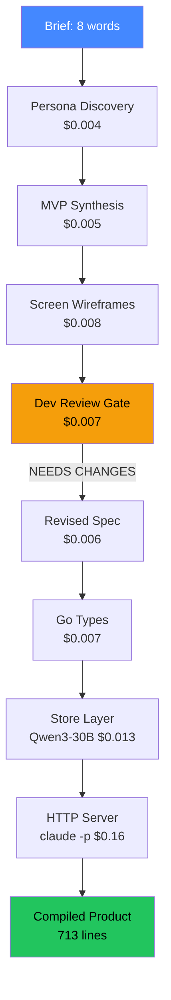
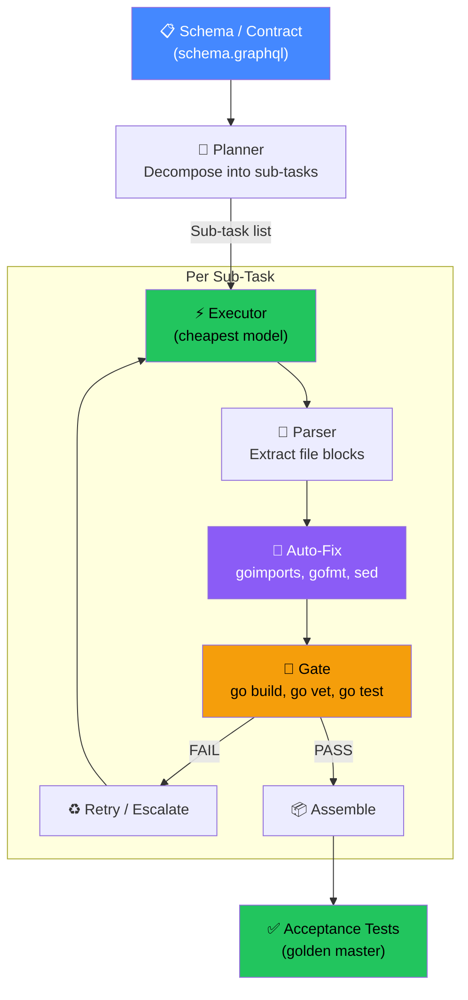

# Experiment Overview

## Research Question

**Can AI go from a one-line idea to a running product? What's the cheapest way?**

25 experiments across code generation, product design, and end-to-end pipelines. Tested 11+ models, 4 architectures, persona interviews, dev review gates, and V-Model verification. Total research cost: ~$5.00.

## The Answer: $0.21 from Idea to Product

## Top 5 Findings

1. **Persona interviews find features the brief missed** (Exp 23) — "recurring invoices" wasn't in the brief but 3/4 personas demanded it
2. **Dev review catches complexity before code** (Exp 25) — PDF generation, SMTP, PII concerns caught at $0.007, not at development
3. **Prompt wording > model choice** (Exp 3, 15) — same model goes 0% → 100% with better prompt
4. **Auto-fix is free money** (Exp 4, 16) — goimports + &constant fix catches 40-60% of errors
5. **Wireframes produce better code** (Exp 24) — 6 routes/106 lines vs 3 routes/493 lines

## All Experiments

| # | Name | Result | Cost | Key Finding |
|---|------|--------|------|-------------|
| [01](exp-01/README.md) | Escalation (Cheap → Strong) | 0/5 FAIL | $0.13 | Escalation doesn't fix shared blind spots |
| [02](exp-02/README.md) | Sub-Task Granularity | Partial | $0.04 | 1 file per task is optimal for quality |
| [03](exp-03/README.md) | V1 Re-Run (Improved Prompts) | 100% pass | $0.05 | V4 prompt: "just output the file" wins |
| [04](exp-04/README.md) | Auto-Fix Pipeline | 40-60% fixed | FREE | goimports → gofmt → sed → vet → build |
| [05](exp-05/README.md) | Model Routing by Task Type | 0/5 FAIL | $0.05 | Single-shot fails; retry loop essential |
| [06](exp-06/README.md) | Claude Sub Models (Sonnet vs Haiku) | Both pass | FREE | Haiku 3x faster, equal quality |
| [07](exp-07/README.md) | Hybrid Pipeline | Design | — | Cheap API for planning, free sub for execution |
| [08](exp-08/README.md) | MiniMax Backtick Hint | 2/3 pass | $0.03 | Explicit hint: "use concatenation, not literals" |
| [09](exp-09/README.md) | Full App via API Only | Parser fail | $0.045 | Parser is the weakest link (~40% of failures) |
| [10](exp-10/README.md) | V-Model Pattern | Conceptual ✅ | $0.032 | Hidden acceptance tests work as surprise gate |
| [11](exp-11/README.md) | PR Review Gate | Design | — | AI reviewer catches issues tests don't |
| [12](exp-12/README.md) | Full-Stack App (70s) | ✅ 7 files | FREE | Complete app from schema in ~1 minute |
| [13](exp-13/README.md) | Parser Hardening | v2: 8/8 tests | $0.07 | Parser wasn't the bottleneck; code quality is |
| [14](exp-14/README.md) | Model Routing + Retry | 50% (model only) | $0.111 | Retry works for fixable errors, not blind spots |
| [15](exp-15/README.md) | Tiered Escalation | **100%** T1 only! | $0.030 | Better prompt fixed backtick — cheapest model does it all |
| [16](exp-16/README.md) | Sub-Task Granularity (v2) | **100%** (5/5) | $0.115 | 2 files/task + auto-fix = 100% on cheapest model |
| [17](exp-17/README.md) | V-Model Full Loop | **100%** (3/3) | $0.037 | Spec→build works; acceptance test extraction needs work |
| [18](exp-18/README.md) | Full Pipeline E2E | 0% (main.go) | $0.167 | Prompt hint works in isolation, fails in context |
| [19](exp-19/README.md) | V2 Re-run (dep-doctor) | 94% compile | $0.084 | Compile gate 0%→94%; golden tests need planner |
| [20](exp-20/README.md) | URL Shortener (new app) | Store works | $0.019 | Approach generalises; claude -p needs foreground |
| [21](exp-21-statuspulse/README.md) | **StatusPulse (4 services)** | **4/4 build** | $0.021 | 1,540 lines, 4 microservices, $0.02 total |
| [22](exp-22-journeys/README.md) | **Brief → Journeys → Screens** | 8+ screens | $0.038 | $0.04 design turns code into a product |
| [23](exp-23-personas/README.md) | **Persona Interview Loop** | 2 accept, 2 reject → APPROVED | $0.051 | Personas found features NOT in brief |
| [24](exp-24-wireframes-to-code/README.md) | Wireframes → Code | 6 routes, BUILD PASS | $0.20 | 106 lines vs 493 — wireframes give focus |
| [25](exp-25-full-pipeline/README.md) | **Full Pipeline: Brief → Product** | Store+Server PASS | $0.21 | 8 words → compiled app, dev review caught issues |
| [26](exp-26-tests/README.md) | **Add Test Layers** | 33/36 (92%) | $0.12 | Store + acceptance + HTTP tests, $0.33 total with code |

## Spike Progression

| Spike | Application | Complexity | Tests | Best Result |
|-------|------------|------------|-------|-------------|
| [V1](spike-v1/REPORT.md) | Bash script (--model flag) | 2 files, 5 tests | 5/5 | All 11 models pass ($0.008-$0.015) |
| [V2](spike-v2/REPORT.md) | Node.js CLI (dep-doctor) | 10 files, 18 tests | 18/18 | A3: $0.069, A5: $0.10 |
| [V3](spike-v3/REPORT.md) | Go CRUD (task-board) | 6 files, 22 tests | 22/22 | Haiku: FREE in 70s |

## Architecture Diagram

## Top 5 Findings

1. **Prompt wording > model choice** — V4 prompt took Qwen3-30B from 0% to 100% pass rate. The prompt says "just output the file content" instead of procedural instructions.

2. **The pipeline IS the product** — Single-shot calls fail ~50%. The same models hit 100% with retry loop + auto-fix + structural gates. Invest in infrastructure, not expensive models.

3. **Auto-fix is free money** — goimports + gofmt + unused-var sed fixes 40-60% of model errors without any API call. Always run structural fixes before retrying.

4. **Subscription beats API** — Haiku builds a full-stack app in 70 seconds for FREE. API equivalent costs ~$0.12. For subscription users, this is the optimal path.

5. **Parser is the bottleneck** — 40% of API-model failures are parser extraction issues, not model quality. A production-grade parser would make all-API builds reliable.

## Cost Summary

| Category | Cost |
|----------|------|
| Spikes V1-V3 (original research) | ~$3.00 |
| Experiments 13-18 (code generation) | ~$0.80 |
| Experiments 19-21 (multi-service) | ~$0.25 |
| Experiments 22-25 (product design + pipeline) | ~$0.55 |
| **Total research cost** | **~$4.60** |
| **Cost per app (proven)** | **$0.02-0.21** |

## Next Steps

- **Add test layers**: Store tests (2-file), acceptance tests (V-Model), HTTP integration tests
- **Pipeline integration**: Wire winning strategy into Dark Factory daemon
- **Blueprint update**: Persona discovery + dev review + exact types as standard stages
