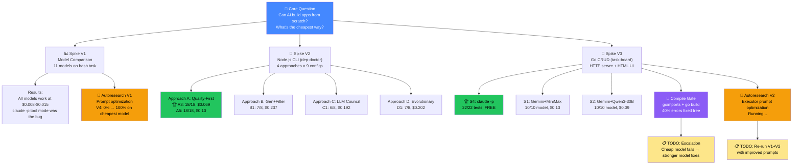

# Experiment Map

## Research Overview

## Experiment Index

| Spike | Application | Files | Tests | Report |
|-------|------------|-------|-------|--------|
| V1 | Bash task (--model flag) | 2 | 5 | [REPORT](spike-v1/REPORT.md) |
| V2 | Node.js CLI (dep-doctor) | 10 | 18 | [REPORT](spike-v2/REPORT.md) |
| V3 | Go CRUD (task-board) | 6 | 22 | [REPORT](spike-v3/REPORT.md) |

## Key Results Timeline

```mermaid
gantt
    title Research Timeline
    dateFormat HH:mm
    axisFormat %H:%M

    section Spike V1
    11 model comparison       :v1, 15:00, 60min
    Autoresearch prompts      :v1ar, 21:00, 15min

    section Spike V2
    Approach A (4 configs)    :v2a, 19:00, 30min
    Approach B (gen+filter)   :v2b, 19:30, 20min
    Approach C (council)      :v2c, 19:30, 20min
    Approach D (evolutionary) :v2d, 19:30, 20min
    A5 Qwen3-30B 18/18       :v2a5, 21:20, 5min

    section Spike V3
    Golden master             :v3gm, 21:30, 15min
    S4 claude -p 22/22       :v3s4, 22:00, 5min
    S1/S2 OpenRouter          :v3or, 22:00, 30min
    Compile gate + auto-fix   :v3fix, 22:30, 30min
    Autoresearch executor     :v3ar, 23:50, 30min
```

## Cost Summary

| Experiment | API Calls | OpenRouter Cost | Subscription Cost |
|-----------|-----------|----------------|-------------------|
| Spike V1 (11 models) | ~30 | $0.35 | — |
| Spike V2 (9 configs) | ~200 | $1.50 | — |
| Spike V2 autoresearch | ~24 | $0.05 | — |
| Spike V3 (3 configs) | ~30 | $0.30 | $0.50 (claude -p) |
| Spike V3 compile fix runs | ~20 | $0.25 | — |
| Spike V3 autoresearch | ~100 | $0.05 | — |
| **Total** | **~400** | **~$2.50** | **~$0.50** |

**Total research cost: ~$3.00**
