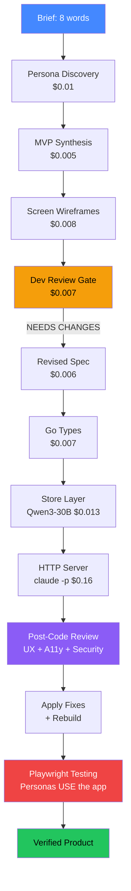
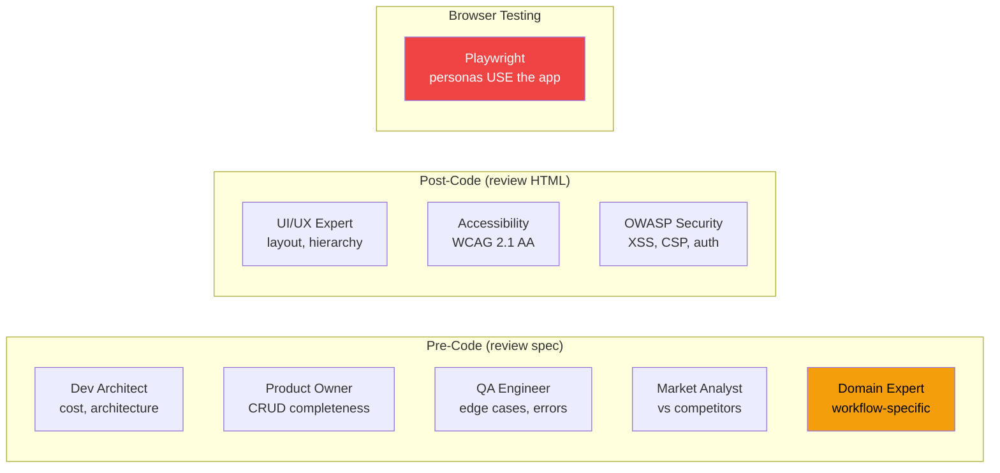

# Experiment Overview

## Research Question

**Can AI go from a one-line idea to a running, tested, reviewed product?**

32 experiments across code generation, product design, 8-reviewer panels, and browser testing. Key finding: **22 API tests + 8 reviewers missed 3 bugs that Playwright found in 10 seconds.**

## The Pipeline: $0.40-0.96 from Idea to Reviewed Product

## Top 7 Findings

1. **Playwright catches what 22 tests + 8 reviewers miss** (Exp 32) — CSP blocking JS, multipart form parsing, JSON error responses. 3 bugs, 0 caught by anything else.
2. **Persona interviews find features the brief missed** (Exp 23) — "recurring invoices" wasn't in the brief but 3/4 personas demanded it
3. **Domain expert found ALL 10 invoicing features missing** (Exp 32) — print, pay, void, line items, tax, recurring. Generic reviewers missed all of these.
4. **Dev review catches complexity before code** (Exp 25) — PDF generation, SMTP, PII concerns caught at $0.007
5. **Progressive enhancement > one-shot builds** (Exp 32 vs 33) — 10 features at once: $0.96, tests fail. One feature at a time: $0.23, zero regression.
6. **Prompt wording > model choice** (Exp 3, 15) — same model goes 0% → 100% with better prompt
7. **Post-code security fixes can break the app** (Exp 32) — CSP header blocked all inline JavaScript

## All Experiments

| # | Name | Result | Cost | Key Finding |
|---|------|--------|------|-------------|
| [01](exp-01/README.md) | Escalation (Cheap → Strong) | 0/5 FAIL | $0.13 | Escalation doesn't fix shared blind spots |
| [02](exp-02/README.md) | Sub-Task Granularity | Partial | $0.04 | 1 file per task is optimal for quality |
| [03](exp-03/README.md) | V1 Re-Run (Improved Prompts) | 100% pass | $0.05 | V4 prompt: "just output the file" wins |
| [04](exp-04/README.md) | Auto-Fix Pipeline | 40-60% fixed | FREE | goimports → gofmt → sed → vet → build |
| [05](exp-05/README.md) | Model Routing by Task Type | 0/5 FAIL | $0.05 | Single-shot fails; retry loop essential |
| [06](exp-06/README.md) | Claude Sub Models (Sonnet vs Haiku) | Both pass | FREE | Haiku 3x faster, equal quality |
| [07](exp-07/README.md) | Hybrid Pipeline | Design | — | Cheap API for planning, free sub for execution |
| [08](exp-08/README.md) | MiniMax Backtick Hint | 2/3 pass | $0.03 | Explicit hint: "use concatenation, not literals" |
| [09](exp-09/README.md) | Full App via API Only | Parser fail | $0.045 | Parser is the weakest link (~40% of failures) |
| [10](exp-10/README.md) | V-Model Pattern | Conceptual ✅ | $0.032 | Hidden acceptance tests work as surprise gate |
| [11](exp-11/README.md) | PR Review Gate | Design | — | AI reviewer catches issues tests don't |
| [12](exp-12/README.md) | Full-Stack App (70s) | ✅ 7 files | FREE | Complete app from schema in ~1 minute |
| [13](exp-13/README.md) | Parser Hardening | v2: 8/8 tests | $0.07 | Parser wasn't the bottleneck; code quality is |
| [14](exp-14/README.md) | Model Routing + Retry | 50% (model only) | $0.111 | Retry works for fixable errors, not blind spots |
| [15](exp-15/README.md) | Tiered Escalation | **100%** T1 only! | $0.030 | Better prompt fixed backtick — cheapest model does it all |
| [16](exp-16/README.md) | Sub-Task Granularity (v2) | **100%** (5/5) | $0.115 | 2 files/task + auto-fix = 100% on cheapest model |
| [17](exp-17/README.md) | V-Model Full Loop | **100%** (3/3) | $0.037 | Spec→build works; acceptance test extraction needs work |
| [18](exp-18/README.md) | Full Pipeline E2E | 0% (main.go) | $0.167 | Prompt hint works in isolation, fails in context |
| [19](exp-19/README.md) | V2 Re-run (dep-doctor) | 94% compile | $0.084 | Compile gate 0%→94%; golden tests need planner |
| [20](exp-20/README.md) | URL Shortener (new app) | Store works | $0.019 | Approach generalises; claude -p needs foreground |
| [21](exp-21-statuspulse/README.md) | **StatusPulse (4 services)** | **4/4 build** | $0.021 | 1,540 lines, 4 microservices, $0.02 total |
| [22](exp-22-journeys/README.md) | **Brief → Journeys → Screens** | 8+ screens | $0.038 | $0.04 design turns code into a product |
| [23](exp-23-personas/README.md) | **Persona Interview Loop** | 2 accept, 2 reject → APPROVED | $0.051 | Personas found features NOT in brief |
| [24](exp-24-wireframes-to-code/README.md) | Wireframes → Code | 6 routes, BUILD PASS | $0.20 | 106 lines vs 493 — wireframes give focus |
| [25](exp-25-full-pipeline/README.md) | **Full Pipeline: Brief → Product** | Store+Server PASS | $0.21 | 8 words → compiled app, dev review caught issues |
| [26](exp-26-tests/README.md) | **Add Test Layers** | 33/36 (92%) | $0.12 | Store + acceptance + HTTP tests, $0.33 total with code |
| [27](exp-27-automated/README.md) | **Fully Automated** | 41/41 (100%) | $0.49 | CRM with invoices, 720 lines, zero intervention |
| [29](exp-29-crm-gqlgen/README.md) | **CRM + gqlgen GraphQL** | BUILD PASS | ~$0.50 | Pipeline needs iterative mode for code generation |
| [30](exp-30-reviewed/README.md) | **4-Reviewer Panel CRM** | 51/51 (100%) | $0.40 | Product reviewer caught missing Add/Delete; all fixed |
| [31](exp-31-post-code-review/README.md) | **Post-Code: UX+A11y+OWASP** | Fixes applied, 54/54 | $0.025 | ARIA labels, XSS fixes, CSP headers added |
| [32](exp-32-domain-expert/README.md) | **8 Reviewers + Domain Expert** | 22/22 HTTP | $0.96 | Domain expert found 10 missing invoice features; store too complex for cheap model |
| [33](exp-33-add-feature/README.md) | **Add Feature (CSV Export)** | 55/55, no regression | $0.23 | Added feature without breaking 52 existing tests |
| [34](exp-34-simplicity/README.md) | **Simplicity Agent** | 13/13, 173+345 lines | $0.20 | 70% less code, 79% cheaper than Exp 32 |
| [35](exp-35-playwright/README.md) | **Playwright Journeys** | 3 pass, 5 fail | — | Simplicity agent cut features from the brief |

## Spike Progression

| Spike | Application | Complexity | Tests | Best Result |
|-------|------------|------------|-------|-------------|
| [V1](spike-v1/REPORT.md) | Bash script (--model flag) | 2 files, 5 tests | 5/5 | All 11 models pass ($0.008-$0.015) |
| [V2](spike-v2/REPORT.md) | Node.js CLI (dep-doctor) | 10 files, 18 tests | 18/18 | A3: $0.069, A5: $0.10 |
| [V3](spike-v3/REPORT.md) | Go CRUD (task-board) | 6 files, 22 tests | 22/22 | Haiku: FREE in 70s |

## The 8-Reviewer Panel

| Reviewer | What They Catch | Cost | Exp |
|----------|----------------|------|-----|
| Persona interviews | Features brief missed | $0.005 | 23 |
| Dev architect | Over-engineering | $0.005 | 25 |
| Product owner | Missing CRUD buttons | $0.006 | 30 |
| QA engineer | Missing error states | $0.004 | 30 |
| Market analyst | No differentiation | $0.005 | 30 |
| Domain expert | 10/10 workflows missing | $0.006 | 32 |
| UI/UX expert | Hierarchy, feedback | $0.006 | 31 |
| Accessibility | ARIA, keyboard, contrast | $0.005 | 31 |
| OWASP security | XSS, CSP (broke the app!) | $0.009 | 31-32 |
| **Playwright** | **3 bugs nothing else found** | **~$0.10** | **32** |

## Cost Summary

| Category | Cost |
|----------|------|
| Spikes V1-V3 (original) | ~$3.00 |
| Experiments 13-21 (code gen + multi-service) | ~$1.05 |
| Experiments 22-30 (design + reviewers) | ~$2.50 |
| Experiments 31-33 (post-code + features) | ~$1.20 |
| **Total research cost** | **~$7.75** |
| **Cost per reviewed app** | **$0.40-0.96** |

## Next Steps

- **Playwright persona testing** — automate browser journey verification
- **Simplicity agent** — "is this necessary? is this the simplest way?" at every stage
- **Progressive enhancement** — build simple, add features one at a time
- **Domain expert from brief** — auto-generate domain reviewer based on product type
- **Pipeline integration** — wire into Dark Factory daemon
