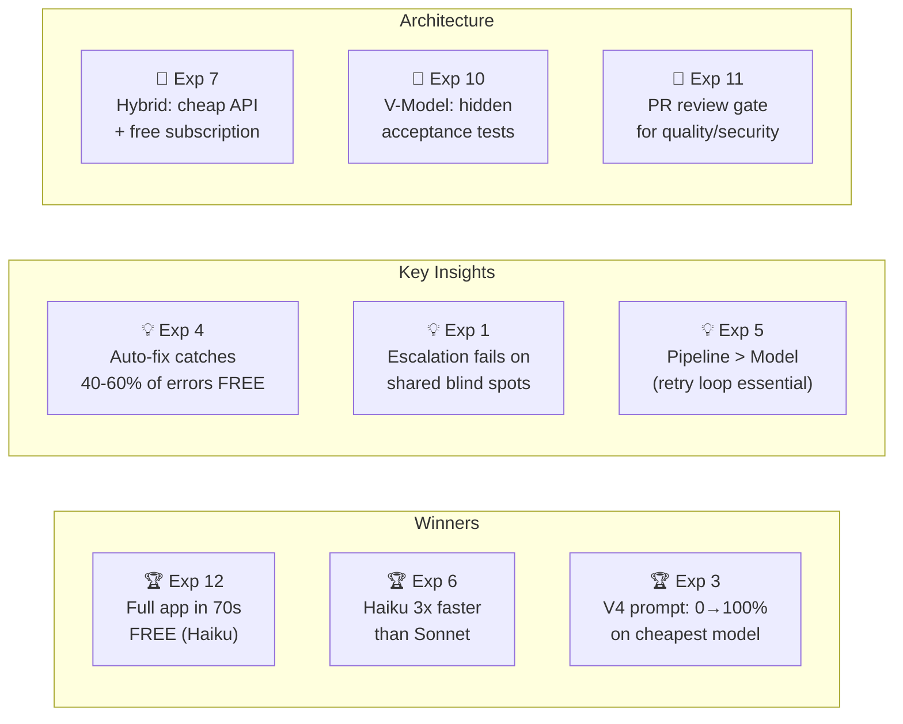
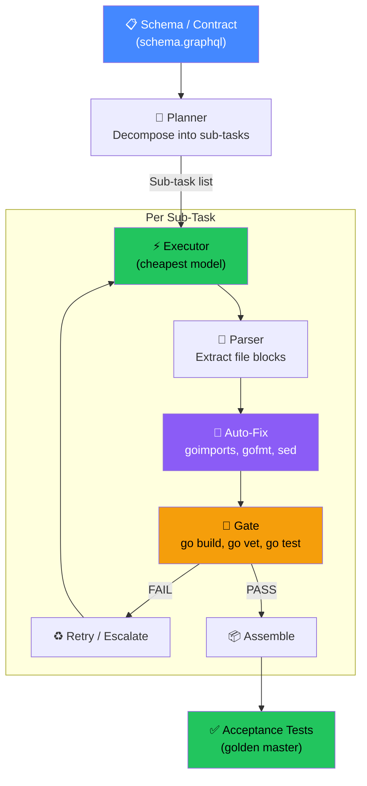

# Experiment Overview

## Research Question

**Can AI models build working applications from scratch? What's the cheapest way?**

We ran 12 experiments across 3 spikes (increasing complexity), testing 11+ models, 4 architectural approaches, and multiple pipeline strategies. Total research cost: ~$3.00.

## Results at a Glance

## All Experiments

| # | Name | Result | Cost | Key Finding |
|---|------|--------|------|-------------|
| [01](exp-01/README.md) | Escalation (Cheap → Strong) | 0/5 FAIL | $0.13 | Escalation doesn't fix shared blind spots |
| [02](exp-02/README.md) | Sub-Task Granularity | Partial | $0.04 | 1 file per task is optimal for quality |
| [03](exp-03/README.md) | V1 Re-Run (Improved Prompts) | 100% pass | $0.05 | V4 prompt: "just output the file" wins |
| [04](exp-04/README.md) | Auto-Fix Pipeline | 40-60% fixed | FREE | goimports → gofmt → sed → vet → build |
| [05](exp-05/README.md) | Model Routing by Task Type | 0/5 FAIL | $0.05 | Single-shot fails; retry loop essential |
| [06](exp-06/README.md) | Claude Sub Models (Sonnet vs Haiku) | Both pass | FREE | Haiku 3x faster, equal quality |
| [07](exp-07/README.md) | Hybrid Pipeline | Design | — | Cheap API for planning, free sub for execution |
| [08](exp-08/README.md) | MiniMax Backtick Hint | 2/3 pass | $0.03 | Explicit hint: "use concatenation, not literals" |
| [09](exp-09/README.md) | Full App via API Only | Parser fail | $0.045 | Parser is the weakest link (~40% of failures) |
| [10](exp-10/README.md) | V-Model Pattern | Conceptual ✅ | $0.032 | Hidden acceptance tests work as surprise gate |
| [11](exp-11/README.md) | PR Review Gate | Design | — | AI reviewer catches issues tests don't |
| [12](exp-12/README.md) | Full-Stack App (70s) | ✅ 7 files | FREE | Complete app from schema in ~1 minute |
| [13](exp-13/README.md) | Parser Hardening | v2: 8/8 tests | $0.07 | Parser wasn't the bottleneck; code quality is |
| [16](exp-16/README.md) | Sub-Task Granularity (v2) | **100%** (5/5) | $0.115 | 2 files/task + auto-fix = 100% on cheapest model |

## Spike Progression

| Spike | Application | Complexity | Tests | Best Result |
|-------|------------|------------|-------|-------------|
| [V1](spike-v1/REPORT.md) | Bash script (--model flag) | 2 files, 5 tests | 5/5 | All 11 models pass ($0.008-$0.015) |
| [V2](spike-v2/REPORT.md) | Node.js CLI (dep-doctor) | 10 files, 18 tests | 18/18 | A3: $0.069, A5: $0.10 |
| [V3](spike-v3/REPORT.md) | Go CRUD (task-board) | 6 files, 22 tests | 22/22 | Haiku: FREE in 70s |

## Architecture Diagram

## Top 5 Findings

1. **Prompt wording > model choice** — V4 prompt took Qwen3-30B from 0% to 100% pass rate. The prompt says "just output the file content" instead of procedural instructions.

2. **The pipeline IS the product** — Single-shot calls fail ~50%. The same models hit 100% with retry loop + auto-fix + structural gates. Invest in infrastructure, not expensive models.

3. **Auto-fix is free money** — goimports + gofmt + unused-var sed fixes 40-60% of model errors without any API call. Always run structural fixes before retrying.

4. **Subscription beats API** — Haiku builds a full-stack app in 70 seconds for FREE. API equivalent costs ~$0.12. For subscription users, this is the optimal path.

5. **Parser is the bottleneck** — 40% of API-model failures are parser extraction issues, not model quality. A production-grade parser would make all-API builds reliable.

## Cost Summary

| Category | Cost |
|----------|------|
| Spike V1 (11 models) | $0.35 |
| Spike V2 (9 configs, 4 approaches) | $1.50 |
| Spike V2 autoresearch | $0.05 |
| Spike V3 (3 configs) | $0.30 |
| Spike V3 compile fix runs | $0.25 |
| Spike V3 autoresearch | $0.05 |
| Experiments 1-12 | ~$0.50 |
| **Total** | **~$3.00** |

## Remaining Experiments (TODO)

See [TODO.md](../TODO.md) for the full list. Key remaining:

- **Parser hardening** — Production parser to fix the 40% extraction failure rate
- **Full pipeline retry** — Re-run model routing (exp-05) with retry loop instead of single-shot
- **Bigger apps** — SvelteKit + Go GraphQL (2000+ lines) to test scaling
- **Pipeline integration** — A/B test winning strategy in Dark Factory daemon
- **V-Model full loop** — Complete the acceptance test feedback loop (exp-10)
