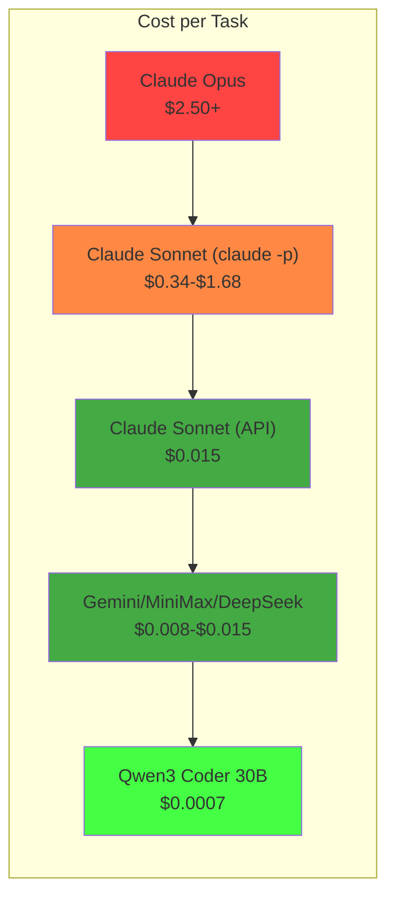
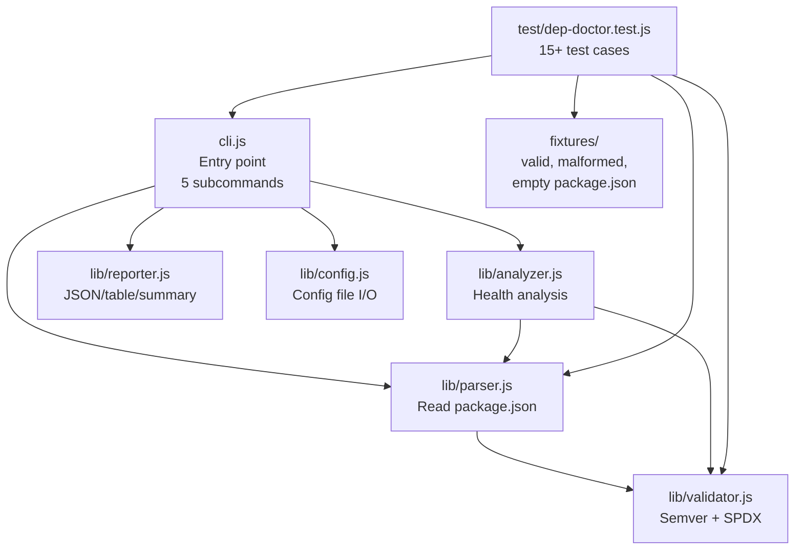
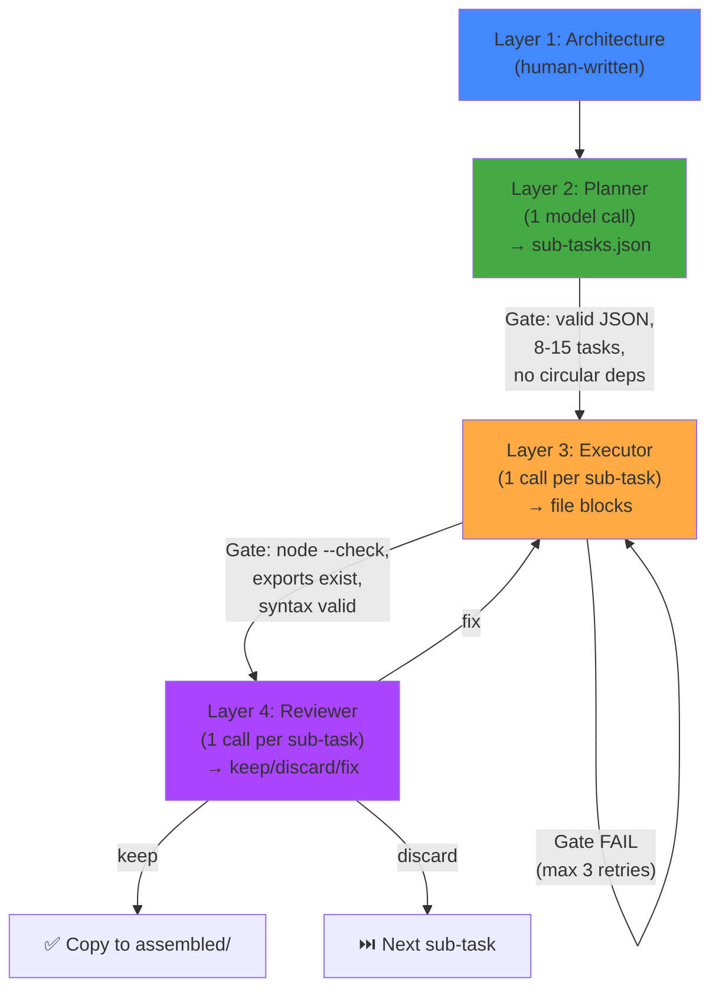
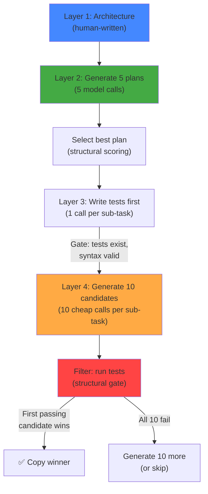
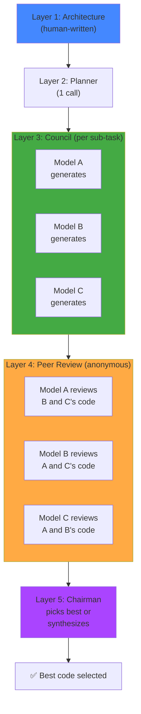
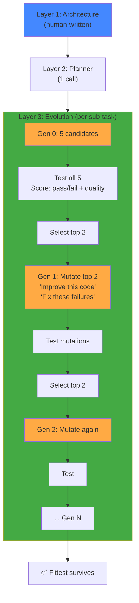
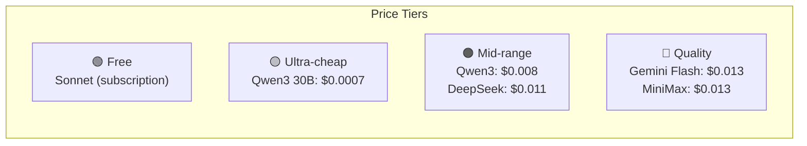
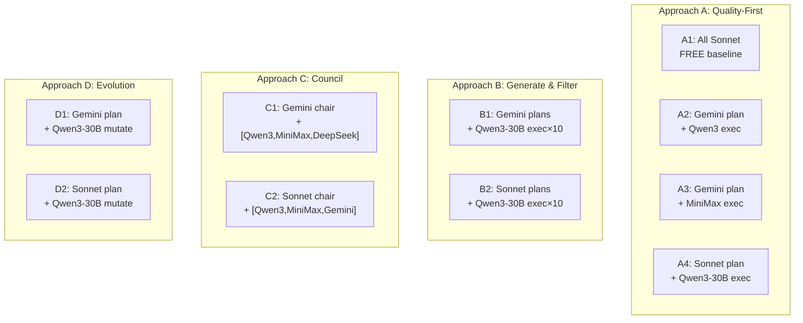
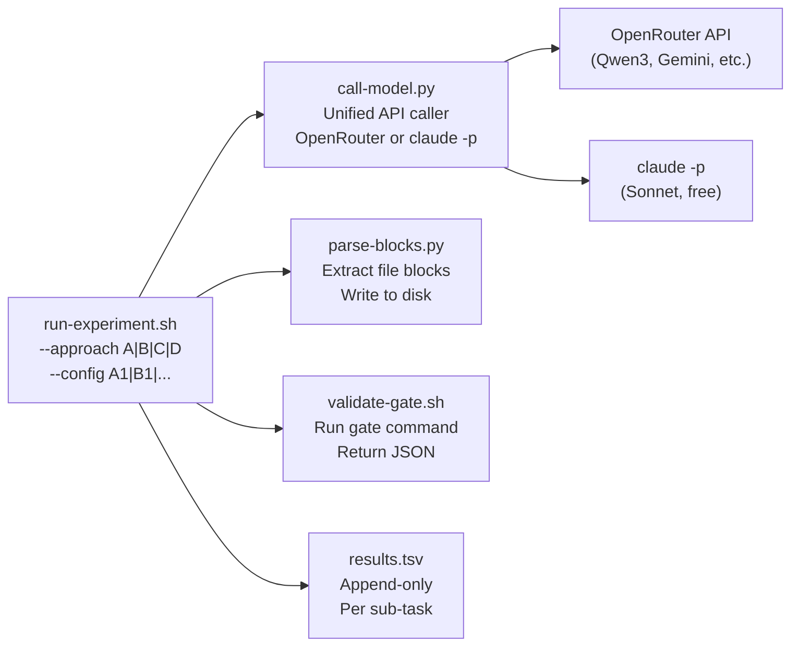
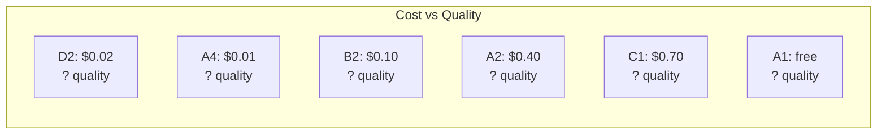

# Spike V2: Multi-Model Orchestration Research

## Can AI build a real application from scratch — and what's the cheapest way?

This research spike tests **4 fundamentally different approaches** to AI-driven software development, across **6 models** at price points spanning 200x (from $0.0007 to $0.15 per call). The goal: find the optimal architecture for Dark Factory's autonomous pipeline.

---

## Table of Contents

1. [Background & Motivation](#background--motivation)
2. [The Test Application](#the-test-application)
3. [Four Approaches](#four-approaches)
4. [Models Under Test](#models-under-test)
5. [Experiment Configurations](#experiment-configurations)
6. [Infrastructure](#infrastructure)
7. [Results & Analysis](#results--analysis)
8. [Conclusions & Recommendations](#conclusions--recommendations)

---

## Background & Motivation

### The Problem

Dark Factory's autonomous pipeline uses Claude to write code. But:

- **Sonnet via `claude -p` tool mode:** $1.68 per task, 0% success rate on complex tasks
- **Sonnet via API with imperative prompts:** $0.015 per task, 100% success rate
- **Qwen3 Coder 30B via OpenRouter:** $0.0007 per task, unknown quality on complex tasks

The 2400x cost difference between the worst and best approach means the choice of architecture matters more than the choice of model.

### Spike V1 Findings

We tested 11 models on a simple bash task ("add --model flag to queue-add.sh"):



**Key insight:** The model isn't the bottleneck — the **prompt pattern** is. All 11 models (including Sonnet) produce correct code when given:
1. The existing file content inline
2. Specific instructions ("add X after Y")
3. The "full file output" format (`--- FILE: path --- ... --- END FILE ---`)

### Research Questions

This spike answers 10 questions:

1. Does careful orchestration (A) beat brute-force generation (B)?
2. Does peer review by multiple models (C) catch bugs that single review misses?
3. Does evolutionary pressure (D) find solutions that single-shot misses?
4. Is a reviewer layer worth its cost?
5. Which model works best at which role (planner/executor/reviewer)?
6. Can the cheapest model ($0.0007/call) produce passing code given enough attempts?
7. Does writing tests before implementation reliably guide the code?
8. What is the minimum cost for a working 500-line application?
9. Which approach produces the most maintainable code?
10. Can approaches be combined for even better results?

---

## The Test Application

### `dep-doctor` — Dependency Health Checker

A Node.js CLI tool that reads `package.json`, analyzes dependency health, and outputs structured reports. Chosen because:

- **Structurally verifiable** — `node cli.js --help` exit code, JSON validity, test pass count
- **Realistic complexity** — 7 files, ~500 lines, multiple modules with dependencies
- **Zero npm dependencies** — the tool itself uses only Node.js built-ins (matches Dark Factory convention)
- **Multiple subcommands** — tests routing, argument parsing, output formatting



### File Structure

| File | Lines | Purpose | Validation Gate |
|------|-------|---------|----------------|
| `fixtures/valid/package.json` | ~20 | Test data | `JSON.parse()` succeeds |
| `fixtures/malformed/package.json` | ~5 | Invalid JSON test data | File exists |
| `fixtures/empty/package.json` | ~3 | Edge case | `JSON.parse()` succeeds |
| `lib/validator.js` | ~60 | Semver + SPDX validation | `typeof isValidSemver === 'function'` |
| `lib/parser.js` | ~60 | Parse package.json | `typeof parse === 'function'` |
| `lib/config.js` | ~40 | Config file read/write | `typeof loadConfig === 'function'` |
| `lib/analyzer.js` | ~100 | Dependency health analysis | `typeof analyze === 'function'` |
| `lib/reporter.js` | ~80 | Output formatting | `typeof formatJson === 'function'` |
| `cli.js` | ~80 | Entry point | `--help` exits 0, `unknown` exits 1 |
| `test/dep-doctor.test.js` | ~120 | 15+ test cases | Exits 0, 15+ "PASS" in stdout |

### Acceptance Criteria

The application is "done" when:
1. `node cli.js --help` exits 0 and lists 5 subcommands
2. `node cli.js scan --path fixtures/valid` outputs valid JSON with dependency list
3. `node cli.js check --path fixtures/valid` exits 0 (healthy)
4. `node cli.js check --path fixtures/malformed` exits 1 (unhealthy)
5. `node test/dep-doctor.test.js` exits 0 with 15+ PASS lines and 0 FAIL lines

---

## Four Approaches

### Approach A: 4-Layer Quality-First

Inspired by Karpathy's **autoresearch** pattern: plan carefully, execute precisely, review critically.



**Cost model:** 1 plan call + N execute calls + N review calls = ~2N+1 calls total
**Estimated cost:** $0.20-$0.60 per build (OpenRouter) or **free** (Sonnet subscription)

### Approach B: Generate-and-Filter

Inspired by DeepMind's **AlphaCode**: generate many candidates cheaply, filter by tests.



**Key insight:** At $0.0007/call (Qwen3 30B), generating 1000 candidates costs $0.70. Quality comes from **filtering**, not from the model.

**Cost model:** 5 plans + N tests + 10N candidates = ~11N+5 calls total
**Estimated cost:** $0.50-$1.50 per build

### Approach C: LLM Council

Inspired by Karpathy's **llm-council**: multiple models generate independently, then peer-review each other.



**Key insight:** Models are "surprisingly willing to select another LLM's response as superior to their own." — Karpathy

**Cost model:** 1 plan + 3N generate + 3N review + N chairman = ~7N+1 calls total
**Estimated cost:** $0.50-$0.80 per build

### Approach D: Evolutionary

Inspired by **genetic algorithms**: breed, test, select, mutate, repeat.



**Key insight:** At $0.0007/call, 5 generations × 5 candidates = 25 calls = $0.0175 per sub-task. Evolution is almost free.

**Cost model:** 1 plan + N × (pop_size × generations) calls = ~125N+1 calls total (but at $0.0007 each!)
**Estimated cost:** $0.20-$0.50 per build

---

## Models Under Test



| Model | ID | $/call (est) | Strengths | Best For |
|-------|-----|-------------|-----------|----------|
| **Sonnet** | `claude -p` | **free** | Reliable with imperative prompts | Planner, reviewer |
| **Qwen3 30B** | `qwen/qwen3-coder-30b-a3b-instruct` | $0.0007 | Ultra-cheap, fast | Volume executor (B, D) |
| **Qwen3 Coder** | `qwen/qwen3-coder` | $0.008 | Cheapest quality model | Executor (A) |
| **MiniMax M2.7** | `minimax/minimax-m2.7` | $0.013 | Best V1 validation score | Council member (C) |
| **Gemini Flash** | `google/gemini-2.5-flash` | $0.013 | Best V1 preservation | Planner, chairman (C) |
| **DeepSeek V3.2** | `deepseek/deepseek-v3.2` | $0.011 | Strong value | Council member (C) |

---

## Experiment Configurations

### 10 Configs Across 4 Approaches



| Config | Approach | Planner | Executor | Reviewer/Filter | Est Cost | Est Calls |
|--------|----------|---------|----------|----------------|----------|-----------|
| A1 | Quality-first | Sonnet | Sonnet | Sonnet | **free** | ~30 |
| A2 | Quality-first | Gemini | Qwen3 | Gemini | ~$0.40 | ~30 |
| A3 | Quality-first | Gemini | MiniMax | DeepSeek | ~$0.50 | ~30 |
| A4 | Quality-first | Sonnet | Qwen3-30B | Sonnet | ~$0.01 | ~30 |
| B1 | Gen+Filter | Gemini(×5) | Qwen3-30B(×10) | Tests | ~$1.00 | ~150 |
| B2 | Gen+Filter | Sonnet(×5) | Qwen3-30B(×10) | Tests | ~$0.10 | ~150 |
| C1 | Council | Gemini | [Q3,MM,DS] | Peer review | ~$0.70 | ~80 |
| C2 | Council | Sonnet | [Q3,MM,Gem] | Peer review | ~$0.50 | ~80 |
| D1 | Evolution | Gemini | Qwen3-30B | Tests | ~$0.30 | ~250 |
| D2 | Evolution | Sonnet | Qwen3-30B | Tests | ~$0.02 | ~250 |
| **Total** | | | | | **~$3.50** | **~1000** |

---

## Infrastructure

### Runner Architecture



### File Layout

```
scripts/dev-spike-v2/
├── README.md                    # This document
├── architecture.md              # Human-written spec (control variable)
├── run-experiment.sh            # Main runner
├── call-model.py                # Unified model caller
├── parse-blocks.py              # File block parser
├── validate-gate.sh             # Structural gate runner
├── results.tsv                  # All experiment data
├── prompts/
│   ├── planner.md               # Sub-task decomposition prompt
│   ├── executor.md              # File generation prompt
│   ├── reviewer.md              # Code review prompt
│   ├── test-writer.md           # Test-first prompt (Approach B)
│   ├── council-review.md        # Peer review prompt (Approach C)
│   ├── chairman.md              # Synthesis prompt (Approach C)
│   └── mutator.md               # "Improve this code" prompt (Approach D)
├── attempts/
│   ├── A1-001/
│   │   ├── plan.json
│   │   ├── ST-01/
│   │   │   ├── prompt.txt
│   │   │   ├── response.json
│   │   │   ├── gate-result.json
│   │   │   └── review.json
│   │   └── assembled/
│   │       └── dep-doctor/      # The final working app
│   └── ...
└── REPORT.md                    # Final analysis

```

### Results Tracking

Every API call produces one row in `results.tsv`:

| Field | Type | Description |
|-------|------|-------------|
| approach | A/B/C/D | Which approach |
| config | A1/B1/... | Which model config |
| attempt | 001 | Attempt number |
| layer | planner/executor/reviewer/... | Which layer |
| sub_task | ST-01 | Which sub-task |
| model | qwen/qwen3-coder | Model used |
| cost_usd | 0.0007 | Cost of this call |
| time_s | 3 | Wall clock seconds |
| tokens_in | 1200 | Input tokens |
| tokens_out | 890 | Output tokens |
| gate_pass | true/false | Structural gate result |
| review_verdict | keep/discard/fix/n/a | Reviewer verdict |
| quality_0_10 | 8 | Quality score |
| retry | 0/1/2 | Retry number |
| files_created | 1 | Files extracted from response |
| error | | Error message if failed |
| timestamp | ISO 8601 | When |

---

## Results & Analysis

*This section will be populated after experiments run.*

### Expected Outputs

#### Build Outcomes Table
| Config | Total Cost | Build Time | Sub-tasks Passed | Tests Passing | Final Working? |
|--------|-----------|-----------|------------------|---------------|----------------|

#### Model Performance by Layer
| Model | Planner Success% | Executor Gate Rate% | Reviewer Agreement% | Avg Cost/Call |
|-------|-----------------|--------------------|--------------------|---------------|

#### Approach Comparison
| Approach | Avg Cost | Success Rate | Best Config | Worst Config |
|----------|---------|-------------|-------------|-------------|

#### Cost Efficiency Frontier



---

## Conclusions & Recommendations

*To be written after experiments complete.*

### Template

1. **Winning approach:** A/B/C/D with config X
2. **Best planner model:** ...
3. **Best executor model:** ...
4. **Is reviewer worth it:** yes/no (saves $X per bug caught)
5. **Minimum cost for working app:** $X.XX
6. **Recommended pipeline architecture:** ...
7. **Next steps for Dark Factory integration:** ...

---

## Appendix: Karpathy Research References

| Pattern | Source | How We Use It |
|---------|--------|--------------|
| Autoresearch loop | [karpathy/autoresearch](https://github.com/karpathy/autoresearch) | Time-boxed experiments, keep/discard, results.tsv |
| Verifiability principle | [Blog post](https://karpathy.bearblog.dev/verifiability/) | Structural gates as the quality filter |
| LLM Council | [karpathy/llm-council](https://github.com/karpathy/llm-council) | Approach C: peer review |
| Model tiers | [AnalyticsVidhya](https://www.analyticsvidhya.com/blog/2025/08/llm-workflow-for-developers/) | Opus plan, Sonnet execute, Qwen3 volume |
| AlphaCode | [DeepMind](https://deepmind.google/blog/competitive-programming-with-alphacode/) | Approach B: generate-and-filter |
| TDAD | [arXiv](https://arxiv.org/html/2603.17973) | Specific test targets, not procedural TDD |
| Agentic Engineering | [Karpathy 2026](https://thenewstack.io/vibe-coding-is-passe/) | Structured oversight, quality gates |
