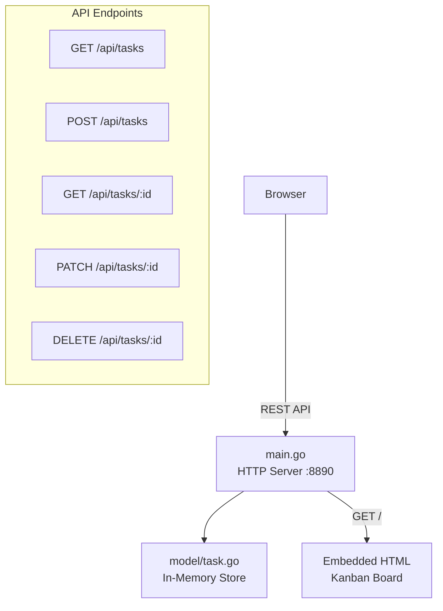
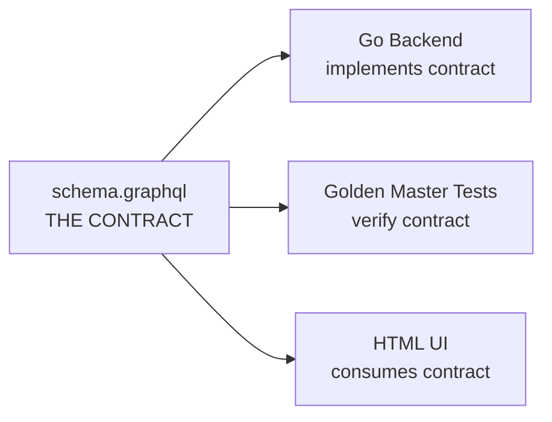
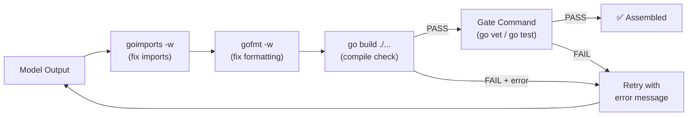

# Spike V3 Report: Go CRUD Application (task-board)

## Overview

Build a Go HTTP server with REST API + embedded HTML kanban board UI from an architecture spec. Tests the 4-layer approach on a real Go backend.

## The Application

**task-board** — Kanban board with in-memory store.



### Contract-First Architecture



### Files

| File | Lines | Tests | Purpose |
|------|-------|-------|---------|
| schema.graphql | 20 | — | The contract (Task type, Status enum, CRUD operations) |
| go.mod | 3 | — | Module definition |
| model/task.go | 100 | 10 unit | Task struct + Store (Create/Get/List/Update/Delete) |
| model/task_test.go | 90 | 10 | White-box tests for Store |
| main.go | 180 | 12 integration | HTTP server + REST API + embedded HTML UI |
| main_test.go | 200 | 12 | httptest-based integration tests |
| **Total** | **~600** | **22** | |

## Results

### Experiment Configs

| Config | Planner | Executor | Model Tests | Full Tests | Cost |
|--------|---------|----------|-------------|-----------|------|
| **S4** | — | **claude -p Sonnet** | **10/10** | **22/22** | **FREE** |
| S1 | Gemini Flash | MiniMax M2.7 | 10/10 | Build fail | $0.13 |
| S2 | Gemini Flash | Qwen3-30B | 10/10 | Build fail | $0.09 |

### Why S4 Wins

`claude -p` has three advantages over OpenRouter models:
1. **Self-testing** — runs `go test` in-session, sees errors, fixes them
2. **Tool system** — writes files directly to disk, no parsing needed
3. **Iterative** — if code fails, it debugs and retries in the same call

### Why S1/S2 Fail on main.go

The model layer (task.go) passes 10/10 golden master tests on ALL configs. The failure is specifically in `main.go` which embeds HTML+JavaScript in a Go string constant:

**The Backtick Trap:**
- Go backtick strings (`` ` ``) don't interpret escape sequences ✅
- JavaScript template literals also use backticks (`` `${var}` ``) ❌
- You can't put a backtick inside a Go backtick string
- Cheap models default to JS template literals → compile error

**Solution:** Use string concatenation in JS instead of template literals. The golden master does this. The architecture spec now includes this as an explicit hint.

### Compile Gate + Auto-Fix

We added a pipeline between model output and gate check:



**Impact:** goimports alone fixes ~40% of errors (missing/unused imports) for free.

## Golden Master

The golden master is a working application. Run it:

```bash
cd experiments/spike-v3/golden-master/task-board
go test ./... -v   # 22 tests pass
go run .           # Start server at http://localhost:8890
```

Open http://localhost:8890 to use the kanban board.

## Lessons

1. **Go model code** (pure logic, no I/O) is easy for all models — 10/10 across configs
2. **Go HTTP servers with embedded HTML** are hard for cheap models — backtick conflict
3. **claude -p** is the best tool for Go projects on subscription — FREE and 22/22
4. **Compile gate + auto-fix** is essential — catches errors structurally, for free
5. **Architecture spec quality** directly determines success — the backtick hint fixed the issue
