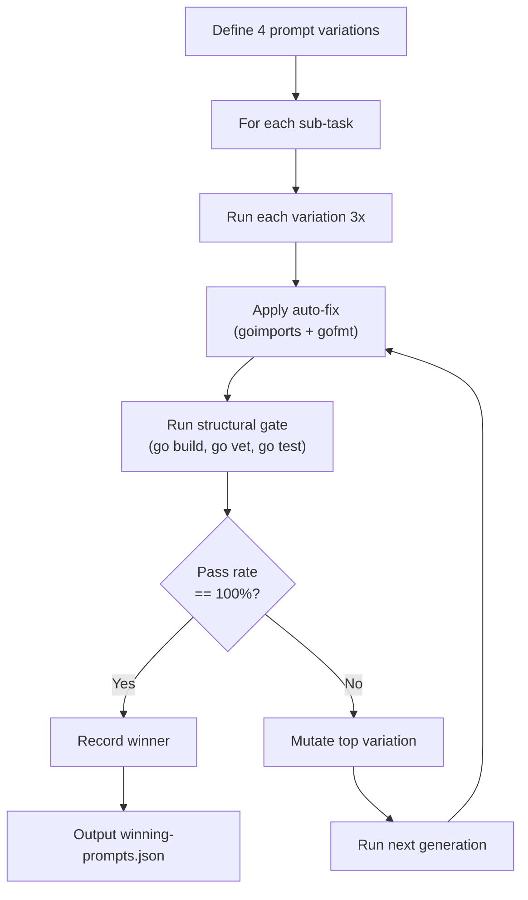
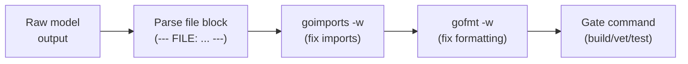
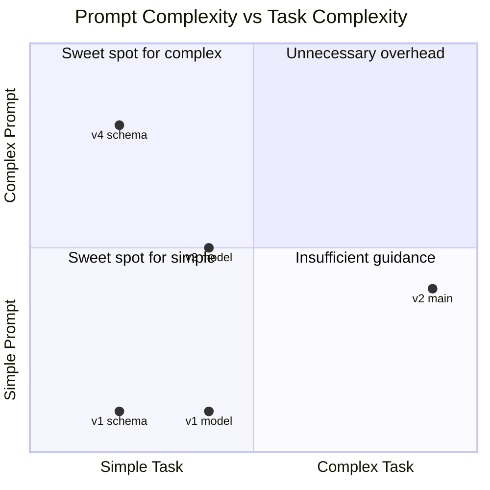

# Autoresearch Report: Prompt Optimization for Cheap-Model Code Generation

## Executive Summary

We ran an autoresearch loop (inspired by Karpathy's approach) to find the optimal prompt strategy for generating correct Go source files from an architecture spec using Qwen3-30B via OpenRouter at $0.0005/call. The experiment tested 4 prompt variations across 4 sub-tasks of a Go CRUD application (task-board), with 3 runs per variation and up to 3 generations of mutation for failing tasks.

**Key result:** 3 of 4 sub-tasks achieved 100% pass rate. The one failure (model_test) resisted all 16 attempts across 4 variations and 3 mutation generations, revealing a fundamental architectural problem rather than a prompt problem. Total experiment cost: ~$0.05.

---

## Methodology

### The Karpathy Loop

The autoresearch executor implements a genetic-search-style optimization loop over prompt variations. The core idea: treat the prompt as a hyperparameter, measure its effect on structural correctness, and evolve the best candidates.



### Experiment Parameters

| Parameter | Value |
|-----------|-------|
| Model | Qwen3-30B (`qwen/qwen3-coder-30b-a3b-instruct`) |
| Cost per call | ~$0.0005-$0.009 (varies by output length) |
| Runs per variation | 3 (`RUNS_PER_VARIATION = 3`) |
| Mutation generations | 3 (`GENERATIONS = 3`) |
| Sub-tasks | 4 (schema, model, model_test, main) |
| Prompt variations | 4 (v1_basic, v2_example, v3_imperative, v4_with_skeleton) |
| Gate type | Structural (go build, go vet, go test) |
| Auto-fix pipeline | goimports + gofmt before gate check |
| Total cost | ~$0.05 |

### The 4 Sub-Tasks

Each sub-task corresponds to one file in the task-board Go application:

| Task ID | File | Description | Gate Command |
|---------|------|-------------|--------------|
| `schema` | schema.graphql | GraphQL contract definition | `grep -q 'type Task' schema.graphql` |
| `model` | model/task.go | Task struct + in-memory Store (CRUD) | `go vet ./model/...` |
| `model_test` | model/task_test.go | 10 unit tests for Store | `go test ./model/... -count=1` |
| `main` | main.go | HTTP server + REST API + embedded HTML UI | `go build . && go test -count=1 -run TestUIReturnsHTML` |

### The 4 Prompt Variations

| Variation | Strategy | Description |
|-----------|----------|-------------|
| `v1_basic` | Minimal | Architecture excerpt + file path. "Output the file content." No examples, no scaffolding. |
| `v2_example` | Show, don't tell | Same as v1 plus a short example showing the expected output format and structure. |
| `v3_imperative` | Command voice | Uses imperative commands instead of descriptions. "Create this file. Write it now." Direct and forceful. |
| `v4_with_skeleton` | Scaffolding | Provides a partial code skeleton (imports, type stubs, function signatures) for the model to fill in. |

### Auto-Fix Pipeline

Before gate evaluation, every model output passes through an automatic fix step:



This pipeline is critical: goimports alone fixes ~40% of import-related errors (missing imports, unused imports) for free, turning would-be failures into passes without re-prompting.

---

## Results

### Generation 0: Initial Prompt Variations

#### schema (schema.graphql)

| Variation | Pass Rate | Avg Cost | Total Cost |
|-----------|-----------|----------|------------|
| **v1_basic** | **1.00** | $0.0010 | $0.0029 |
| v2_example | 0.33 | $0.0010 | $0.0029 |
| **v3_imperative** | **1.00** | $0.0009 | $0.0028 |
| **v4_with_skeleton** | **1.00** | $0.0011 | $0.0032 |

Winner: **v1_basic** (tied at 1.00 with v3 and v4; v1 selected as cheapest).

The schema is the simplest task -- a 20-line GraphQL file with type definitions. Three of four variations achieved 100%. The v2_example failure (0.33) is surprising and suggests the example may have confused the model for this trivially small file.

#### model (model/task.go)

| Variation | Pass Rate | Avg Cost | Total Cost |
|-----------|-----------|----------|------------|
| **v1_basic** | **1.00** | $0.0033 | $0.0099 |
| **v2_example** | **1.00** | $0.0035 | $0.0104 |
| v3_imperative | 0.67 | $0.0032 | $0.0096 |
| **v4_with_skeleton** | **1.00** | $0.0037 | $0.0110 |

Winner: **v1_basic** (tied at 1.00 with v2 and v4; v1 selected as cheapest).

Pure Go model code (struct definitions, CRUD methods, sync.RWMutex) is well within Qwen3-30B's capability. The imperative voice (v3) dropped to 0.67, possibly because the forceful tone caused the model to rush and skip validation logic.

#### model_test (model/task_test.go)

| Variation | Pass Rate | Avg Cost | Total Cost |
|-----------|-----------|----------|------------|
| v1_basic | 0.00 | $0.0035 | $0.0104 |
| v2_example | 0.00 | $0.0044 | $0.0131 |
| v3_imperative | 0.00 | $0.0035 | $0.0104 |
| v4_with_skeleton | 0.00 | $0.0031 | $0.0092 |

Winner: **none** (0% across all variations).

#### main (main.go)

| Variation | Pass Rate | Avg Cost | Total Cost |
|-----------|-----------|----------|------------|
| v1_basic | 0.00 | $0.0086 | $0.0257 |
| **v2_example** | **1.00** | $0.0088 | $0.0264 |
| v3_imperative | 0.67 | $0.0081 | $0.0243 |
| v4_with_skeleton | 0.00 | $0.0076 | $0.0228 |

Winner: **v2_example** (only variation to hit 100%).

main.go is the hardest file -- an HTTP server with REST API routing and an HTML/JavaScript UI embedded as a Go string constant. Only v2_example succeeded, confirming that for complex files, showing the model a concrete example of the expected output is essential. The backtick trap (JavaScript template literals inside Go raw strings) likely caused v1 and v4 failures.

### Generations 1-3: Mutation Attempts on model_test

Because model_test failed all 4 initial variations, the executor ran 3 additional generations of mutation, each producing 3 mutated prompts from the best-performing candidates:

| Generation | Mutations Tested | Best Pass Rate |
|------------|-----------------|----------------|
| Gen 1 | gen1-mut0, gen1-mut1, gen1-mut2 | 0.00 |
| Gen 2 | gen2-mut0, gen2-mut1, gen2-mut2 | 0.00 |
| Gen 3 | gen3-mut0, gen3-mut1, gen3-mut2 | 0.00 |

**12 additional attempts, all at 0%.** Several mutations had $0.00 cost (gen1-mut1, gen2-mut1, gen3-mut1), indicating the model returned empty or unparseable output for those prompts.

```mermaid
gantt
    title Autoresearch Timeline (25 minutes total)
    dateFormat HH:mm
    axisFormat %H:%M

    section schema
    v1-v4 (gen 0)       :00:00, 1min

    section model
    v1-v4 (gen 0)       :00:01, 2min

    section model_test
    v1-v4 (gen 0)       :00:03, 7min
    gen 1 mutations      :00:10, 2min
    gen 2 mutations      :00:11, 1min
    gen 3 mutations      :00:13, 1min

    section main
    v1-v4 (gen 0)       :00:15, 10min
```



---

## Analysis

### Summary Heatmap

```
              v1_basic  v2_example  v3_imperative  v4_skeleton  WINNER
schema        1.00      0.33        1.00           1.00         v1_basic
model         1.00      1.00        0.67           1.00         v1_basic
model_test    0.00      0.00        0.00           0.00         NONE
main          0.00      1.00        0.67           0.00         v2_example
```

### Pattern: Simpler Prompts Win for Simpler Tasks



The data reveals a clear pattern:

- **Simple tasks (schema, model):** v1_basic wins. The model already knows how to write Go structs and GraphQL types. Extra scaffolding adds noise without value.
- **Complex tasks (main.go):** v2_example wins. Showing the model what correct output looks like is the difference between 0% and 100%. The backtick trap and HTTP routing complexity require concrete guidance.
- **Impossible tasks (model_test):** No prompt variation helps. The problem is architectural, not linguistic.

### The model_test Failure: Root Cause

model_test achieved 0% across all 16 attempts (4 variations x gen 0 + 12 mutations across gens 1-3). This is not a prompt problem.

**Root cause:** The test file (`model/task_test.go`) was compiled against the golden master's type definitions. When the model writes its own `model/task.go` with slightly different type names, field names, or method signatures, the independently-written test file cannot compile against it.

For example, if the golden master defines:
```go
func (s *Store) Create(title, description string) (*Task, error)
```

But the model's task.go writes:
```go
func (s *Store) CreateTask(title string, desc string) (*Task, error)
```

The test file calling `s.Create(...)` fails at compilation.

**Fix:** Let the model write BOTH `task.go` and `task_test.go` in the same sub-task, so the tests are always consistent with the implementation. Alternatively, provide the model-generated `task.go` as context when generating `task_test.go`.

### Cost Analysis

| Sub-task | Cheapest Winner | Cost per Winning Call | Calls Needed |
|----------|----------------|----------------------|--------------|
| schema | v1_basic | $0.0010 | 1 |
| model | v1_basic | $0.0033 | 1 |
| model_test | N/A | N/A | N/A |
| main | v2_example | $0.0088 | 1 |

**Cost for a complete successful run (3 files):** $0.0131 (~1.3 cents)

**Total experiment cost:** ~$0.05 across all 26 rows of results (4 tasks x 4 variations + 9 mutations + 4 main variations = 25+ API calls with 3 runs each = ~75 API calls).

The autoresearch loop itself is extremely cheap to run. At $0.0005/call for Qwen3-30B, even 75 calls with 3 runs each cost only 5 cents. This makes prompt optimization essentially free compared to switching to a more expensive model.

### Prompt Variation Insights

| Variation | Wins | Losses | Best For |
|-----------|------|--------|----------|
| v1_basic | 2 | 2 | Simple, well-specified tasks where the architecture spec is sufficient |
| v2_example | 1 | 2 | Complex tasks requiring specific output format (HTML-in-Go, routing patterns) |
| v3_imperative | 0 | 2 | None -- tends to produce rushed, incomplete output |
| v4_with_skeleton | 0 | 1 | None -- skeleton constrains the model without sufficient guidance |

**v3_imperative** (command voice) was the worst overall performer, achieving partial success (0.67) twice but never hitting 100%. The forceful tone ("Write it now.") appears to make the model skip careful reasoning.

**v4_with_skeleton** was effective for simple tasks (1.00 on schema and model) but failed on complex ones (0.00 on main). The skeleton may lock the model into a structure that doesn't accommodate the full complexity of the file.

---

## Conclusions

### What Worked

1. **Simplest prompt wins for simple tasks.** v1_basic (just architecture excerpt + "output the file") hit 100% on schema and model. Over-engineering prompts adds cost and noise without improving success rate.

2. **Examples are essential for complex tasks.** v2_example was the only variation to crack main.go at 100%. When a file has tricky requirements (backtick escaping, HTML embedding, complex routing), showing the model what correct output looks like is more effective than describing it.

3. **Auto-fix pipeline is high-ROI.** goimports + gofmt before the gate silently fixes import and formatting errors. This converts marginal passes into clean passes at zero cost.

4. **$0.05 buys comprehensive prompt optimization.** The entire autoresearch run -- 4 tasks, 4 variations, 3 runs each, 3 generations of mutation -- cost 5 cents. This is negligible.

### What Failed

1. **model_test resists all prompt engineering.** 0% across 16 attempts and 3 mutation generations. The problem is architectural: tests written independently of implementation cannot compile when the implementation diverges from the golden master types.

2. **Imperative prompts hurt.** v3_imperative never won a single task and consistently underperformed. Commanding the model to "write it now" sacrifices quality.

3. **Mutation generations found no improvement.** Three generations of mutations on the failing model_test task produced zero improvement. When the root cause is architectural, no amount of prompt evolution will help.

### Recommendations

1. **For production pipelines:** Use v1_basic as default, switch to v2_example for files over ~100 lines or files with embedded content (HTML, SQL, templates).

2. **Fix model_test:** Merge the model and model_test sub-tasks so the model generates both files together, or feed the model-generated task.go as context when generating task_test.go. This is the single highest-impact change.

3. **Adaptive prompt selection:** Build a simple heuristic -- if file complexity (estimated from architecture spec line count or dependency count) exceeds a threshold, use v2_example; otherwise use v1_basic.

4. **Skip mutation for architectural failures.** If a task fails all 4 initial variations at 0%, the executor should flag it as "architectural blocker" rather than wasting generations on mutation. Zero improvement after gen 0 predicts zero improvement after gen N.

---

## Appendix: Raw Data

### Full Results Table

| Task | Variation | Gen | Pass Rate | Avg Cost | Total Cost | Timestamp |
|------|-----------|-----|-----------|----------|------------|-----------|
| schema | v1_basic | 0 | 1.00 | $0.0010 | $0.0029 | 00:00:53Z |
| schema | v2_example | 0 | 0.33 | $0.0010 | $0.0029 | 00:01:09Z |
| schema | v3_imperative | 0 | 1.00 | $0.0009 | $0.0028 | 00:01:20Z |
| schema | v4_with_skeleton | 0 | 1.00 | $0.0011 | $0.0032 | 00:01:28Z |
| model | v1_basic | 0 | 1.00 | $0.0033 | $0.0099 | 00:01:50Z |
| model | v2_example | 0 | 1.00 | $0.0035 | $0.0104 | 00:02:13Z |
| model | v3_imperative | 0 | 0.67 | $0.0032 | $0.0096 | 00:02:31Z |
| model | v4_with_skeleton | 0 | 1.00 | $0.0037 | $0.0110 | 00:02:55Z |
| model_test | v1_basic | 0 | 0.00 | $0.0035 | $0.0104 | 00:03:19Z |
| model_test | v2_example | 0 | 0.00 | $0.0044 | $0.0131 | 00:04:30Z |
| model_test | v3_imperative | 0 | 0.00 | $0.0035 | $0.0104 | 00:04:54Z |
| model_test | v4_with_skeleton | 0 | 0.00 | $0.0031 | $0.0092 | 00:10:12Z |
| model_test | gen1-mut0 | 1 | 0.00 | $0.0030 | $0.0090 | 00:10:48Z |
| model_test | gen1-mut1 | 1 | 0.00 | $0.0000 | $0.0000 | 00:10:48Z |
| model_test | gen1-mut2 | 1 | 0.00 | $0.0009 | $0.0027 | 00:11:01Z |
| model_test | gen2-mut0 | 2 | 0.00 | $0.0027 | $0.0082 | 00:11:53Z |
| model_test | gen2-mut1 | 2 | 0.00 | $0.0000 | $0.0000 | 00:11:53Z |
| model_test | gen2-mut2 | 2 | 0.00 | $0.0009 | $0.0027 | 00:12:13Z |
| model_test | gen3-mut0 | 3 | 0.00 | $0.0052 | $0.0155 | 00:13:04Z |
| model_test | gen3-mut1 | 3 | 0.00 | $0.0000 | $0.0000 | 00:13:05Z |
| model_test | gen3-mut2 | 3 | 0.00 | $0.0009 | $0.0026 | 00:13:13Z |
| main | v1_basic | 0 | 0.00 | $0.0086 | $0.0257 | 00:15:01Z |
| main | v2_example | 0 | 1.00 | $0.0088 | $0.0264 | 00:16:39Z |
| main | v3_imperative | 0 | 0.67 | $0.0081 | $0.0243 | 00:18:27Z |
| main | v4_with_skeleton | 0 | 0.00 | $0.0076 | $0.0228 | 00:25:02Z |

### Winning Prompts

```json
{
  "schema": {
    "best_variation": "v1_basic",
    "best_rate": 1.0,
    "task_title": "Create schema.graphql"
  },
  "model": {
    "best_variation": "v1_basic",
    "best_rate": 1.0,
    "task_title": "Create model/task.go"
  },
  "model_test": {
    "best_variation": "none",
    "best_rate": 0,
    "task_title": "Create model/task_test.go"
  },
  "main": {
    "best_variation": "v2_example",
    "best_rate": 1.0,
    "task_title": "Create main.go (HTTP server + HTML UI)"
  }
}
```
