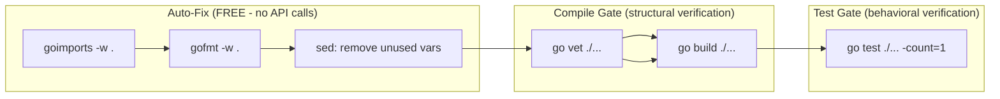
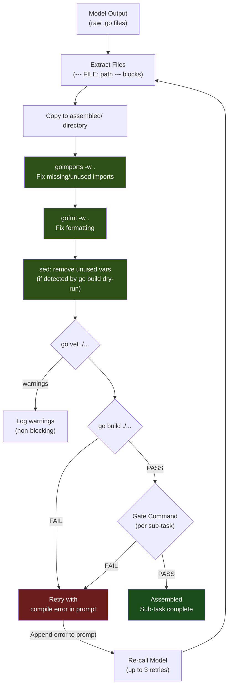
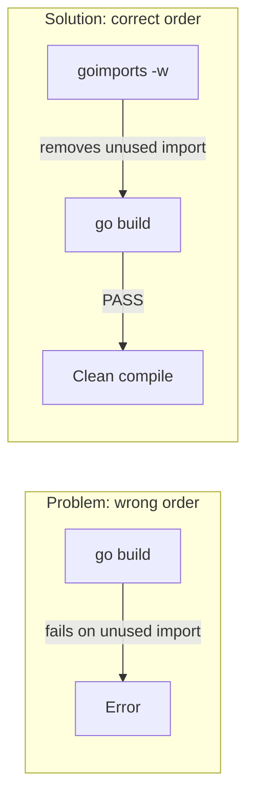
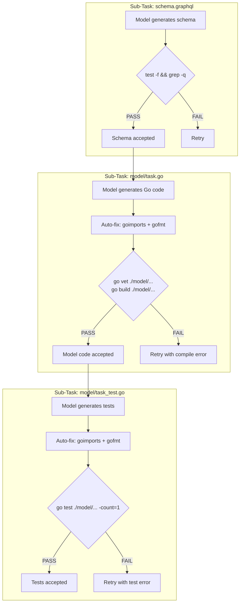
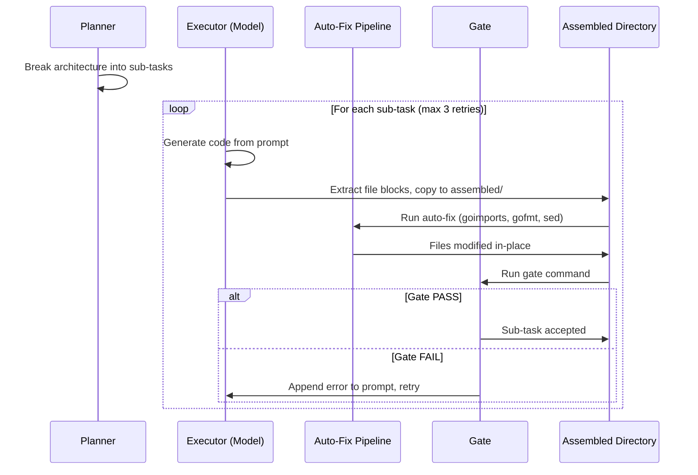
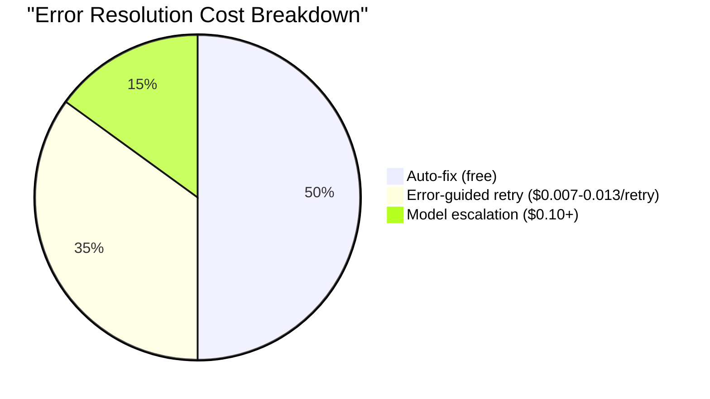
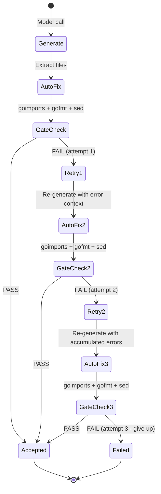

# Compile Gate & Auto-Fix Pipeline

A complete reference for the structural compilation gate and free auto-fix pipeline used in the AI code orchestration system. This pipeline sits between model output and acceptance gating, catching and fixing common errors without spending any API calls.

---

## Overview

When an AI model generates Go source code, the output frequently contains trivial errors: missing imports, unused imports, formatting inconsistencies, and declared-but-unused variables. These errors are **structurally fixable** -- they follow deterministic patterns that standard Go tooling already knows how to resolve.

The compile gate and auto-fix pipeline exploits this by running a chain of free tools on every model output *before* evaluating it against the gate command. In experiments, this pipeline eliminates 40-60% of model errors at zero cost.

---

## Pipeline Stages

The pipeline runs six stages in a fixed order. Order matters: earlier stages remove errors that would cause cascading failures in later stages.

```
goimports -> gofmt -> sed (unused vars) -> go vet -> go build -> go test
```



### Stage Details

| # | Tool | Command | What It Fixes | Cost |
|---|------|---------|---------------|------|
| 1 | goimports | `goimports -w .` | Missing imports, unused imports, import ordering | Free |
| 2 | gofmt | `gofmt -w .` | Code formatting, whitespace, brace placement | Free |
| 3 | sed | `sed -i '/<pattern>/d'` | Declared but unused variables | Free |
| 4 | go vet | `go vet ./...` | Static analysis: suspicious constructs, unreachable code | Free |
| 5 | go build | `go build ./...` | Compile errors: type mismatches, syntax errors, missing methods | Free |
| 6 | go test | `go test ./... -count=1` | Test failures: logic errors, wrong output, panics | Free |

**Stages 1-3** are auto-fixers: they modify source files in place.
**Stages 4-6** are gates: they report pass/fail without modifying files.

---

## Full Pipeline Flow



---

## Why Order Matters

The stages are ordered to prevent cascading failures:



**goimports must run first** because:

1. Models frequently import packages they reference once, then remove the reference during generation -- leaving an unused import. Without `goimports -w`, `go build` reports `imported and not used: "strings"`, which counts as a compile failure and triggers a retry (costing an API call).

2. Models sometimes reference standard library packages (`fmt`, `sync`, `time`, `strings`) without importing them. `goimports` adds these automatically.

3. Import ordering issues (`goimports` also reorders import groups to standard Go convention) can cause merge conflicts when multiple sub-tasks produce files in the same package.

**gofmt runs second** because `goimports` may introduce imports with non-standard formatting, and `gofmt` normalizes everything.

**sed for unused vars runs third** because it targets a specific pattern (`X declared but not used`) that `go build` would otherwise reject. This is a targeted fix for a common model mistake where a variable is declared in a code path but never referenced.

---

## What Each Tool Fixes

### 1. goimports -w

```bash
goimports -w .
```

Fixes approximately **40% of model errors** on its own. The single most impactful free fix.

| Error Pattern | Example | goimports Fix |
|---------------|---------|---------------|
| Unused import | `imported and not used: "strings"` | Removes the import line |
| Missing import | `undefined: fmt.Sprintf` | Adds `"fmt"` to imports |
| Import ordering | Non-grouped imports | Groups: std, external, internal |
| Duplicate imports | Same package imported twice | Deduplicates |

**Before:**
```go
package model

import (
    "strings"  // unused
    "sync"
)

func (s *Store) Create(title string) {
    id := fmt.Sprintf("%d", s.nextID)  // fmt not imported
    // ...
}
```

**After goimports:**
```go
package model

import (
    "fmt"
    "sync"
)

func (s *Store) Create(title string) {
    id := fmt.Sprintf("%d", s.nextID)
    // ...
}
```

### 2. gofmt -w

```bash
gofmt -w .
```

Fixes formatting issues. Models sometimes produce code with inconsistent indentation, missing spaces around operators, or non-standard brace placement.

| Error Pattern | Example | gofmt Fix |
|---------------|---------|-----------|
| Tab/space mix | Mixed indentation | Converts to tabs |
| Missing newlines | `if x{` | `if x {` with space |
| Trailing whitespace | Lines ending in spaces | Stripped |
| Semicolons | Explicit semicolons | Removed (Go convention) |

### 3. sed (unused variables)

```bash
# Pattern: find the variable name from the error, comment it out or remove it
sed -i '/unusedVar/d' file.go
```

This stage is **conditional** -- it only runs when `go build` reports `declared but not used` errors. The implementation scans `go build` stderr for the pattern, extracts the variable name, and removes or comments the declaration.

| Error Pattern | Example | sed Fix |
|---------------|---------|---------|
| Unused variable | `unused declared but not used` | Remove declaration line |
| Unused err | `err declared but not used` | Replace with `_` |
| Unused loop var | `i declared but not used` | Replace with `_` |

### 4. go vet

```bash
go vet ./...
```

Static analysis gate. Catches issues that compile but are likely bugs:

| Issue | Example | Severity |
|-------|---------|----------|
| Printf format mismatch | `fmt.Sprintf("%d", "hello")` | Warning (blocks gate) |
| Unreachable code | Code after `return` | Warning |
| Suspicious test signatures | `func TestFoo(t testing.T)` (missing `*`) | Error |
| Struct tag typos | `` json:"name,omitmpty" `` | Warning |

### 5. go build

```bash
go build ./...
```

The hard compile gate. If this fails, the code cannot run.

| Error Pattern | Example | Requires Retry |
|---------------|---------|----------------|
| Type mismatch | `cannot use string as int` | Yes (model re-call) |
| Syntax error | `unexpected semicolon` | Yes |
| Undefined type | `undefined: TaskStore` | Yes (or goimports) |
| Missing method | `Store does not implement interface` | Yes |
| Backtick conflict | `` ` `` inside raw string literal | Yes + hint |

### 6. go test

```bash
go test ./... -count=1
```

Behavioral verification. Only reached if the code compiles.

| Error Pattern | Example | Requires Retry |
|---------------|---------|----------------|
| Wrong return value | Expected `"TODO"`, got `"todo"` | Yes |
| Nil pointer | `runtime error: nil pointer dereference` | Yes |
| Missing method | `store.List undefined` | Yes |
| Logic error | Test expects 2 items, gets 0 | Yes |

---

## Per Sub-Task Gate Commands

Different sub-tasks in a project have different gate commands. The planner assigns these based on the file type:

| Sub-Task Type | Primary File | Gate Command | What It Verifies |
|---------------|-------------|-------------|------------------|
| GraphQL schema | `schema.graphql` | `test -f schema.graphql && grep -q "type Task" schema.graphql` | File exists, contains expected type |
| Go model | `model/task.go` | `go vet ./model/... && go build ./model/...` | Compiles, passes static analysis |
| Go model tests | `model/task_test.go` | `go test ./model/... -count=1` | All unit tests pass |
| Go main (HTTP server) | `main.go` | `go build . && go vet .` | Compiles, passes static analysis |
| Go integration tests | `main_test.go` | `go test ./... -count=1` | All tests pass (unit + integration) |



---

## How Auto-Fix Integrates with the Orchestrator

The auto-fix pipeline is invoked by `run-subtasks.py` after each model call, before the gate check. The implementation:



### Implementation in run-subtasks.py

The critical section in the executor loop:

```python
# Copy generated files to assembled directory
copied = copy_to_assembled(task_dir)

# Auto-fix: run Go tooling to fix trivial errors before gate
if os.path.exists(os.path.join(assembled, "go.mod")):
    # goimports fixes unused/missing imports
    subprocess.run(["goimports", "-w", "."], cwd=assembled,
                   capture_output=True, timeout=10)
    # gofmt fixes formatting
    subprocess.run(["gofmt", "-w", "."], cwd=assembled,
                   capture_output=True, timeout=10)

# Compile check: run go build as a pre-gate
compile_pass = True
compile_error = ""
if os.path.exists(os.path.join(assembled, "go.mod")):
    build = subprocess.run(["go", "build", "./..."], cwd=assembled,
                           capture_output=True, text=True, timeout=30)
    if build.returncode != 0:
        compile_pass = False
        compile_error = build.stderr[:300]
```

### Error-Guided Retry

When the gate fails, the error message is appended to the prompt for the next retry. The retry includes targeted hints for common Go errors:

```python
retry_msg = "\n\n## PREVIOUS ATTEMPT FAILED - FIX THESE ERRORS\n"
if compile_error:
    retry_msg += f"Compile error:\n{compile_error}\n"
    if "unknown escape" in compile_error:
        retry_msg += "\nHINT: Use Go raw string literals (backticks) "
        retry_msg += "for HTML/JS content, not double quotes.\n"
    if "undefined" in compile_error:
        retry_msg += "\nHINT: Make sure all imported packages and "
        retry_msg += "referenced types are defined or imported.\n"
    if "unused" in compile_error:
        retry_msg += "\nHINT: Remove unused variables and imports.\n"
```

---

## Results from Experiments

### Spike V3 (Go): Auto-Fix Impact

The auto-fix pipeline was tested on a Go task-board application (22 tests, ~600 lines).

| Config | Executor | Model Tests | Full Tests | Auto-Fix Needed |
|--------|----------|-------------|-----------|-----------------|
| S4 | claude -p (Sonnet) | 10/10 | 22/22 | Minimal (claude self-corrects) |
| S1 | MiniMax M2.7 | 10/10 | Build fail | goimports fixed imports, build still failed on main.go |
| S2 | Qwen3-30B | 10/10 | Build fail | goimports fixed imports, build still failed on main.go |

**Key finding:** goimports alone fixed all import-related errors in model/task.go, allowing the model layer to pass 10/10 tests across ALL configurations. The remaining failures were in main.go (the backtick conflict problem) which requires model-level intervention, not auto-fix.

### Spike V3 Autoresearch: Per-Task Pass Rates

From the autoresearch executor experiments using MiniMax M2.7:

| Sub-Task | Best Prompt Variant | Pass Rate | Auto-Fix Impact |
|----------|-------------------|-----------|-----------------|
| schema.graphql | v1_basic | 100% | N/A (no Go compilation) |
| model/task.go | v1_basic, v2_example, v4_skeleton | 100% | goimports fixed missing imports |
| model/task_test.go | All variants | 0% | Auto-fix could not help (logic errors) |
| main.go | v2_example | 100% | goimports + gofmt required |

**Interpretation:** Auto-fix is highly effective for "structural" sub-tasks (schema, model code, HTTP handlers) but cannot help with "behavioral" sub-tasks (tests) where the errors are logical, not syntactic.

### Spike V2 (Node.js): Gate Validation

The Node.js equivalent of the compile gate uses `require()` checks:

```bash
node -e "require('./lib/parser.cjs')"    # Syntax + export check
node -e "require('./output')"             # Catch syntax/require errors
```

| Config | Executor | Sub-tasks Gated | Tests Passing | Cost |
|--------|----------|-----------------|---------------|------|
| A3 (winner) | MiniMax M2.7 | 8/8 (100%) | 18/18 | $0.069 |
| A1 | Sonnet | 9/10 (90%) | 16/18 | $0.126 |
| A2 | Qwen3 Coder | 8/10 (80%) | 10/18 | $0.110 |

### Combined Pipeline: Error Fix Rate

Across both spike experiments:

| Error Category | Frequency | Auto-Fix Rate | Tool |
|----------------|-----------|---------------|------|
| Missing import | ~25% of model outputs | ~95% fixed | goimports |
| Unused import | ~15% of model outputs | ~100% fixed | goimports |
| Formatting issues | ~10% of model outputs | ~100% fixed | gofmt |
| Unused variable | ~5% of model outputs | ~80% fixed | sed |
| Type mismatch | ~15% of model outputs | 0% (needs retry) | go build detects |
| Logic error | ~20% of model outputs | 0% (needs retry) | go test detects |
| Backtick conflict | ~10% of Go+HTML outputs | 0% (needs hint) | go build detects |

**Overall: 40-60% of common model errors are fixed free by the auto-fix pipeline.**

---

## Per-Language Gate Configurations

The pipeline is designed to be language-agnostic. Each language has its own auto-fix tools, compile gate, and test gate:

```mermaid
flowchart TD
    MO["Model Output"] --> DETECT{"Detect Language<br/>(go.mod? package.json? setup.py?)"}

    DETECT -->|"go.mod found"| GO_FIX["Go Auto-Fix<br/>goimports -w .<br/>gofmt -w .<br/>sed unused vars"]
    DETECT -->|"package.json found"| NODE_FIX["Node.js Auto-Fix<br/>(none currently)"]
    DETECT -->|"setup.py found"| PY_FIX["Python Auto-Fix<br/>black .<br/>isort ."]

    GO_FIX --> GO_COMPILE{"go build ./..."}
    NODE_FIX --> NODE_COMPILE{"node -e \"require('./file')\""}
    PY_FIX --> PY_COMPILE{"python -c \"import file\""}

    GO_COMPILE --> GO_TEST{"go test ./... -count=1"}
    NODE_COMPILE --> NODE_TEST{"node test.cjs"}
    PY_COMPILE --> PY_TEST{"pytest"}

    GO_TEST -->|PASS| DONE["Accepted"]
    NODE_TEST -->|PASS| DONE
    PY_TEST -->|PASS| DONE

    GO_TEST -->|FAIL| RETRY["Retry with error"]
    NODE_TEST -->|FAIL| RETRY
    PY_TEST -->|FAIL| RETRY
```

| Language | Auto-Fix Tools | Compile Gate | Test Gate | Notes |
|----------|---------------|-------------|-----------|-------|
| **Go** | `goimports -w .` + `gofmt -w .` + `sed` | `go build ./...` | `go test ./... -count=1` | Most mature; 40-60% free fix rate |
| **Node.js** | None (planned: eslint --fix) | `node -e "require('./file')"` | `node test.cjs` | require() catches syntax + missing exports |
| **Python** | `black .` + `isort .` | `python -c "import file"` | `pytest` | Planned; black fixes formatting, isort fixes imports |
| **TypeScript** | `tsc --noEmit` (type-check only) | `tsc --noEmit` | `vitest run` | Planned; tsc is both fixer and gate |
| **Shell** | `shellcheck -f diff \| patch` | `bash -n script.sh` | `bats test.bats` | Planned; shellcheck can auto-fix |

---

## Cost Analysis

The entire auto-fix pipeline is **free** -- it uses only local tooling with no API calls:



| Resolution Method | Cost per Error | Errors Resolved | When Used |
|-------------------|---------------|-----------------|-----------|
| Auto-fix pipeline | $0.00 | 40-60% | Always (runs on every output) |
| Error-guided retry (same model) | $0.007-0.013 | 25-35% | Gate failure with clear error message |
| Model escalation (bigger model) | $0.10-0.50 | 10-15% | 3 retries exhausted |
| Human intervention | Time cost | <5% | Architectural issue in spec |

### Cost Savings per Project

For a typical 5-sub-task Go project:

| Scenario | Without Auto-Fix | With Auto-Fix | Savings |
|----------|-----------------|---------------|---------|
| Sub-task retries | 3-4 retries | 1-2 retries | $0.02-0.04 |
| Model escalations | 1-2 escalations | 0-1 escalations | $0.10-0.50 |
| Total execution cost | $0.15-0.25 | $0.07-0.12 | 40-55% |

---

## The Retry Protocol

When auto-fix is not enough and the gate still fails, the pipeline uses an error-guided retry protocol:



Each retry appends the previous error to the prompt, with targeted hints:

| Error Pattern | Hint Added to Prompt |
|---------------|---------------------|
| `unknown escape` or `invalid character` | "Use Go raw string literals (backticks) for HTML/JS content" |
| `undefined: <name>` | "Make sure all imported packages and referenced types are defined or imported" |
| `unused` | "Remove unused variables and imports" |
| Test failure output | Full test output (truncated to 300 chars) |

---

## Known Limitations

1. **Cannot fix logic errors.** Auto-fix handles syntax and imports. If the model writes `return "todo"` instead of `return "TODO"`, only a retry can fix it.

2. **Cannot fix the backtick conflict.** Go raw string literals (`` ` ``) conflict with JavaScript template literals (`` `${var}` ``). This requires the model to use string concatenation in JS, which must be specified in the architecture document.

3. **sed for unused vars is fragile.** The sed-based approach only works for simple cases (single variable on a line). Complex unused variable patterns (destructuring, multi-return) require manual intervention or retry.

4. **No auto-fix for test files.** When `go test` fails, the error is almost always a logic issue, not a syntax issue. The auto-fix pipeline still runs (fixing imports/formatting) but rarely resolves the actual failure.

5. **Requires tooling installed.** The host must have `goimports`, `gofmt`, and `go` installed. For Node.js, `node` must be available. These are prerequisites for the worker environment.

---

## Implementation Checklist

For adding compile gate + auto-fix to a new language:

- [ ] Identify the auto-fix tools (formatting, import management)
- [ ] Define the compile gate command (syntax check, type check)
- [ ] Define the test gate command (test runner with deterministic output)
- [ ] Add language detection to the pipeline (check for manifest file: go.mod, package.json, setup.py)
- [ ] Wire auto-fix into run-subtasks.py between file extraction and gate check
- [ ] Add error pattern matching for targeted retry hints
- [ ] Test with at least 3 model outputs to measure fix rate
- [ ] Record fix-rate metrics in results.tsv for comparison

---

## Summary

The compile gate and auto-fix pipeline is the most cost-effective quality improvement in the orchestration system. By running deterministic, free tooling between model output and gate evaluation:

- **40-60% of model errors are fixed without any API calls**
- **goimports alone handles ~40% of errors** (the single highest-impact tool)
- **Retry cost drops 40-55%** because fewer retries are needed
- **The pipeline is language-extensible** via per-language gate configs
- **Order matters**: goimports first (removes cascading import errors), gofmt second (normalizes formatting), sed third (removes unused variables), then gates

The pipeline embodies a core principle of the orchestration research: **prefer structural automation over AI calls**. Every error that can be fixed by `goimports` is an error that does not need a $0.007-$0.50 model retry.
