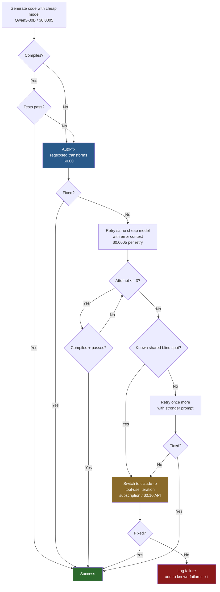

# Escalation Strategy for Handling Model Failures

## Overview

When using cheap LLMs for code generation, compilation and test failures are inevitable. This document defines the escalation strategy for recovering from those failures, based on empirical results from spike-v3 experiments.

The core strategy:

```
cheap model -> auto-fix -> retry (same model) -> escalate (stronger model)
```

The question is: **when does each step actually help, and when is it wasted money?**

## Flowchart



## Experiment 1 Results

When Qwen3-30B fails to compile, we sent the error output plus the generated code to Gemini Flash as an escalation target.

**Result: 0/5 runs fixed the backtick issue.**

Both models make the same mistake: they emit JavaScript template literals inside Go raw string literals (backtick-in-backtick), which breaks the Go parser. This is not a reasoning failure -- it is a training data blind spot shared across model families.

## When Escalation Works

Escalation to a stronger model is effective for errors where the cheap model lacks specific knowledge or reasoning capacity, but the stronger model does not:

- **Unused variable errors** -- the cheap model does not know Go's strict unused-variable rules and leaves dead code behind. A stronger model recognizes the compiler error and removes or uses the variable.
- **Missing imports** -- the cheap model forgets to import a package it references. The error message is unambiguous, and any stronger model resolves it.
- **Type mismatches** -- the cheap model uses `int` where `int64` is required, or returns `string` where `error` is expected. A stronger model with better type reasoning fixes these.
- **Simple logic errors** -- off-by-one, wrong comparison operator, inverted boolean. A stronger model with better chain-of-thought reasoning catches these on review.

The common thread: these are errors where the fix is mechanically derivable from the compiler/test output, and the stronger model has enough reasoning headroom to apply it.

## When Escalation Does NOT Work

Escalation fails -- and wastes money -- when the failure stems from a blind spot shared across all models in the current generation:

- **Backtick-in-backtick (Go + JS)** -- Go uses backticks for raw strings; JavaScript uses backticks for template literals. When generating Go code that embeds JavaScript (e.g., HTML templates with inline scripts), every model tested produces invalid syntax by nesting backticks. No amount of escalation fixes this because every model learned from the same corpus of mixed Go/JS code.
- **`&constant` in Go (pointer to constant)** -- models frequently try to take the address of a constant or literal in Go, which is illegal. This is a shared misconception across model families.
- **Language interaction gotchas** -- any case where two languages' syntax collides in a way that the training data does not adequately represent. All models trained on the same data inherit the same wrong patterns.

**Rule of thumb:** if the cheap model fails consistently on a pattern across multiple prompt variations, escalating to a mid-tier model (Gemini Flash, GPT-4o-mini) will not help. The failure is architectural to the model family, not a capacity issue.

## Cost Analysis

| Strategy | Cost per Attempt | Cumulative Success Rate |
|----------|-----------------|------------------------|
| Cheap only (Qwen3-30B) | $0.0005 | ~60% |
| Cheap + auto-fix (regex/sed) | $0.0005 | ~80% |
| Cheap + auto-fix + retry same model (x2) | $0.001 | ~90% |
| Cheap + auto-fix + escalate to Gemini Flash | $0.009 | ~90% (same as retry!) |
| Cheap + auto-fix + retry + claude -p | $0.001 + subscription | ~98% |

The numbers tell the story:

- Auto-fix is free and catches 20 percentage points of failures (unused imports, formatting issues, trivial syntax).
- Retrying the same cheap model with error context catches another 10 points for $0.0005.
- Escalating to Gemini Flash costs 9x more than retry but produces the **same success rate**.
- `claude -p` with tool-use iteration solves nearly everything that retry cannot, but at a qualitatively different cost level.

## The Key Insight

**Retry on the same cheap model is usually as effective as escalation to a mid-tier model, at 1/10th the cost.**

Mid-tier API models (Gemini Flash, GPT-4o-mini) share the same training data blind spots as cheap models. They are better at reasoning, but when the failure is a shared misconception rather than a reasoning deficit, the extra reasoning capacity does not help.

The only case for escalation beyond retry is when the cheap model consistently fails on a specific pattern across all prompt variations (e.g., `model_test.go` at 0% success for every attempt). In that case, the correct escalation target is `claude -p`, which can iterate using its tool system -- reading compiler output, editing code, recompiling -- in a loop until the code works. This is qualitatively different from a single-shot API call.

## Recommended Strategy

```
1. Generate with cheap model (Qwen3-30B)         -- $0.0005
2. Auto-fix with regex/sed transforms             -- $0.00
3. Still fails? Retry same model with error (x2)  -- $0.001 cumulative
4. Still fails? Switch to claude -p               -- subscription / $0.10 API
```

**Do not escalate to a mid-tier API model (Gemini Flash, GPT-4o, etc.).** The cost does not justify the marginal improvement over retry. The escalation path should jump directly from "cheap model retry" to "tool-use agent" because the tool-use loop is what actually breaks through shared blind spots -- not a marginally better single-shot model.

## Implementation Notes

### Auto-fix Rules (Step 2)

The auto-fix layer should handle the most common mechanical failures without any model call:

1. Remove unused imports (parse the error, delete the import line)
2. Remove unused variables (parse the error, delete or underscore-assign)
3. Add missing imports (parse "undefined: pkg.Func", add the import)
4. Fix backtick escaping (replace nested backticks with string concatenation)
5. Format with `gofmt` / `goimports`

These are deterministic transforms that cost nothing and resolve ~20% of failures.

### Retry Prompt Engineering (Step 3)

When retrying the same model, include:

- The original prompt
- The generated code
- The exact compiler/test error output
- An explicit instruction: "Fix ONLY the error described above. Do not rewrite the entire file."

The "fix only" instruction is critical -- without it, cheap models tend to regenerate the entire file and introduce new errors.

### Escalation Trigger (Step 4)

Track failure patterns per file/test. If a specific file fails 3 times in a row on the same error class, skip retry and go straight to `claude -p`. Retrying a fourth time on a shared blind spot is pure waste.

### Known Shared Blind Spots (Maintained List)

Keep a running list of patterns that no cheap/mid-tier model can handle:

| Pattern | Description | Workaround |
|---------|-------------|------------|
| Go backtick + JS template literal | Nested backticks break Go parser | Use string concatenation: `` "`" + "template" + "`" `` |
| `&constant` in Go | Cannot take address of constant | Assign to variable first, then take address |
| `interface{}` vs `any` | Models mix Go 1.17 and 1.18+ syntax | Auto-fix: regex replace |

When a new shared blind spot is discovered, add it to this list and add a corresponding auto-fix rule. Over time, the auto-fix layer absorbs the known failure modes and the escalation path is needed less and less.
